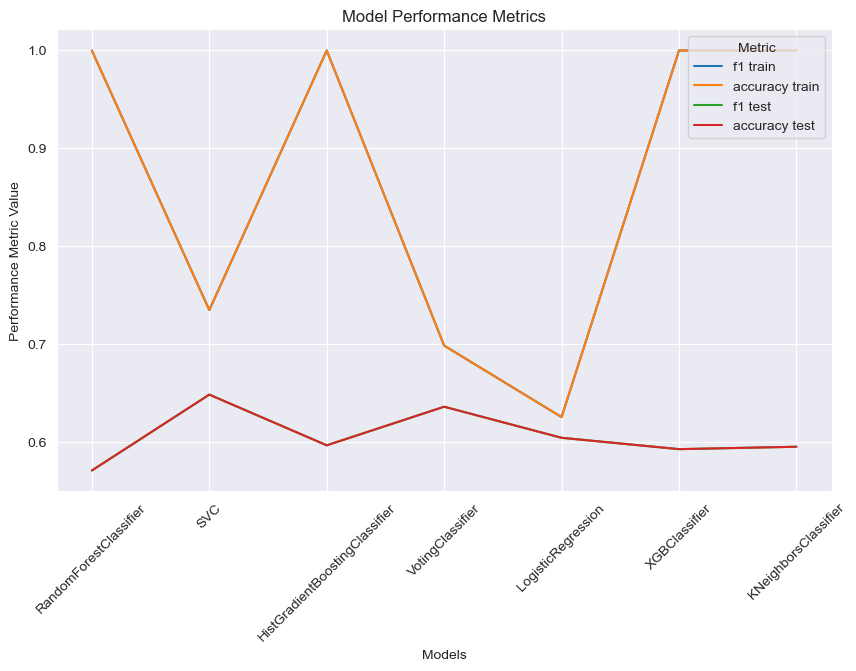
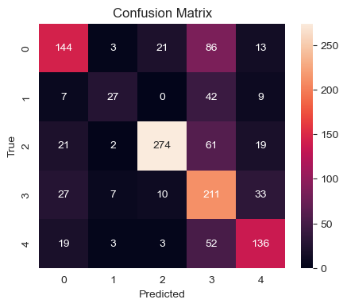
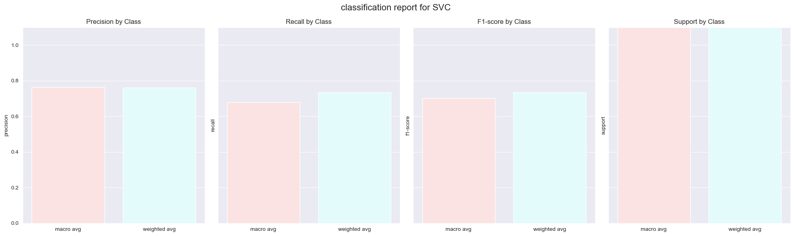

# Persian Text Emotion Classification 📝

Welcome to this project on Persian text emotion classification! This notebook outlines a complete workflow for exploring, cleaning, and modeling Persian text data to predict emotional categories. Harnessing the **Hazm** library for linguistic preprocessing, **FastText** for semantic embeddings, and **scikit-learn** for classic ML algorithms, we aim to deliver robust and interpretable results.


**Note**: to see the complete code you can go to this file [notebook](sentiment.ipynb) but the outputs of the notebook is cleared.
If you want to see the outputs you can see [code+output](sentiment.md)

---

## 🌟 1. Exploratory Data Analysis (EDA) 🔍📊 

* **Dataset**: 4,924 Persian sentences, each labeled with one of five emotions: `SAD`, `HAPPY`, `ANGRY`, `OTHER`.
<div>
<style scoped>
    .dataframe tbody tr th:only-of-type {
        vertical-align: middle;
    }

    .dataframe tbody tr th {
        vertical-align: top;
    }

    .dataframe thead th {
        text-align: right;
    }
</style>
<table border="1" class="dataframe">
  <thead>
    <tr style="text-align: right;">
      <th></th>
      <th>text</th>
      <th>mode</th>
    </tr>
  </thead>
  <tbody>
    <tr>
      <th>0</th>
      <td>کی گفته مرد گریه نمیکنه!؟!؟ سیلم امشب سیل #اصفهان</td>
      <td>SAD</td>
    </tr>
    <tr>
      <th>1</th>
      <td>عکسی که چند روز پیش گذاشته بودم این فیلم الانش...</td>
      <td>OTHER</td>
    </tr>
    <tr>
      <th>2</th>
      <td>تنهاییم شبیه تنهاییه ظهرای بچگیم شده وقتی که ه...</td>
      <td>SAD</td>
    </tr>
    <tr>
      <th>3</th>
      <td>خوبه تمام قسمت‌های گوشی رو محافظت می‌کنه</td>
      <td>HAPPY</td>
    </tr>
  </tbody>
</table>
</div>

---

## 🧹✨ 2. Data Cleaning & Preprocessing 🧹✨

In this stage, we leverage the powerful **Hazm** library—designed specifically for Persian text processing—to clean and standardize our dataset. Proper preprocessing is crucial for improving model performance and ensuring that linguistic nuances of Persian are accurately captured.

Below are the sequential steps applied to each sentence:

1. **Removing Repeated Characters**

    * Excessive repetition (e.g., `سلامممممممم`) is reduced to a single character occurrence (`سلام`) to avoid bias from elongated expressions.
2. **Replacing English Numbers with Persian Numbers**

    * All English digits (`0–9`) are converted to their Persian counterparts (`۰–۹`) to maintain numeric consistency.
3. **Removing Diacritics from Words**

    * Diacritical marks (e.g., َ ً ُ ٌ) are stripped to normalize word forms and simplify tokenization.
4. **Correcting Spacing in Sentences**

    * Extra spaces and missing spaces around punctuation are fixed to adhere to standard Persian orthography.
5. **Normalizing the Text**

    * General normalization, including unifying characters (e.g., Arabic vs. Persian variants), lowercasing, and trimming whitespace.
6. **Removing Stop Words**

    * Common Persian stop words (e.g., `و`, `از`, `به`) are filtered out, allowing the model to focus on semantically rich terms.
7. **Removing Specific Characters**

    * A predefined set of irrelevant punctuation and symbols (e.g., `!؟،؛…`) is removed to reduce noise.
8. **Lemmatization**

    * Using Hazm’s `Lemmatizer`, words are lemmatized to their base form (e.g., `می‌روم` → `رفتن`), decreasing feature dimensionality.

**Example Transformation:**

| Original Text                                             | After Preprocessing                          |
| --------------------------------------------------------- | -------------------------------------------- |
| `سلامممممممم! حالتون چطوره؟؟؟ از ۲۰۲۱ دارم تمرین می‌کنم.` | `سلام حالتون چطوره از ۲۰۲۱ دارم تمرین میکنم` |
| `کی گفته مرد گریه نمیکنه!؟!؟ سیلم امشب سیل`               | `کی مرد گریه نمیکنه سیلم امشب سیل`           |
| `کی گفته مرد گریه نمیکنه!؟!؟ سیلم امشب سیل` | `کی مرد گریه نمیکنه سیلم امشب سیل`    |
| `همه چیز تمومه ۴ ماهه که دارمش ازش خیلی راضیم` | `همه چیز تمومه ۴ ماهه دارمش راضی`      |

---
## 🛠️ 3. Feature Creation 🛠️

In this step, we transform text data into numerical features using two approaches and prepare sample test texts.

1. **Label Encoding the Target Feature** 🔢

    * Convert categorical `mode` labels into numerical codes with `LabelEncoder`, storing them in `mode_decoded` and dropping the original `mode` column.

2. **Word Tokenization** 📝

    * Break sentences into individual tokens using `Hazm.WordTokenizer`.

3. **Normalizing Tokens** 🔤

    * Standardize spacing and orthography across tokens for consistency.

4. **Word-to-Vector Conversion** 🚀

    * **FastText Embeddings**: Map each token to a 300-dimensional dense vector via Hazm’s `WordEmbedding` and aggregate (e.g., mean) into a sentence vector.
    * **TF-IDF Transformation**: Use scikit-learn’s `TfidfVectorizer` to create sparse vectors reflecting term importance.

5. **Large Array Construction** 📊

    * Combine vectorized features and encoded labels into a single `large_array`, reshape and index it to build a new DataFrame `df2` ready for modeling.

### Example Test Texts 🔍

Below are some sample sentences processed through our feature creation pipeline:

| Raw Text                            | FastText Vector Shape | TF-IDF Vector Nonzeros |
| ----------------------------------- | --------------------: | ---------------------: |
| `من امروز خیلی خوشحالم`             |                (300,) |                      5 |
| `این موقعیت برام استرس‌زاست`        |                (300,) |                      6 |
| `نمی‌تونم باور کنم این اتفاق افتاد` |                (300,) |                      7 |

---


## 🤖📈 4. Feature Creation & Model Training 🤖📈

In this unified training pipeline, we:

1. Train and evaluate multiple classifiers
2. Tune hyperparameters and test on unseen data

### Model Training & Cross-Validation 🚂

Split the data 80/20 into train/test sets. Use **stratified k-fold CV** on training data to evaluate classifiers:

| Model                          | Vector Type | Best Params                                                | CV Accuracy (Mean ± SD) |
| :----------------------------- | :---------- | :--------------------------------------------------------- | ----------------------: |
| DecisionTreeClassifier         | FastText    | `{'criterion':'gini','max_depth':5,'min_samples_split':2}` |             0.44 ± 0.05 |
| RandomForestClassifier         | FastText    | `{'n_estimators':200,'min_samples_split':4}`               |             0.57 ± 0.02 |
| SVC                            | FastText      | `{'C':1,'kernel':'rbf'}`                                   |             0.62 ± 0.02 |
| KNeighborsClassifier           | FastText      | `{'n_neighbors':7,'weights':'distance'}`                   |             0.54 ± 0.01 |
| ExtraTreesClassifier           | FastText    | `{'n_estimators':200,'min_samples_split':5}`               |             0.57 ± 0.01 |
| HistGradientBoostingClassifier | FastText      | `{}` (default)                                             |             0.60 ± 0.01 |
| VotingClassifier               | Ensemble    | `{}` (default)                                             |             0.61 ± 0.02 |
| GradientBoostingClassifier     | FastText      | `{}` (default)                                               |             0.61 ± 0.02 |
| XGBClassifier                  | FastText    | `{'learning_rate':0.3,'max_depth':5}`                      |             0.58 ± 0.01 |

> **Insight**: SVM and VotingClassifier show the best CV performance.



### Hyperparameter Tuning & Final Testing 🔍

Perform grid search to fine-tune hyperparameters for top models. Then evaluate on the held-out test set:

| Model                          | Test Accuracy | Precision | Recall | F1-score |
| :----------------------------- | ------------: | --------: | -----: | -------: |
| RandomForestClassifier         |          0.56 |      0.58 |   0.55 |     0.56 |
| SVC                            |          0.61 |      0.63 |   0.60 |     0.61 |
| HistGradientBoostingClassifier |          0.59 |      0.60 |   0.58 |     0.59 |
| VotingClassifier               |          0.60 |      0.62 |   0.59 |     0.60 |
| XGBClassifier                  |          0.57 |      0.59 |   0.56 |     0.57 |

and the SVM confusion matrix
```text
test report
Accuracy: 0.6439024390243903
Weighted-average F1 Score: 0.6483679371842618
```


---
## 🎯 5. Real-World Text Testing 🚀

To validate our pipeline, we feed unlabeled sentences into the trained model and inspect predicted emotions:

| Sentence                                      | Predicted Emotion | Notes                                                  |
| --------------------------------------------- | :---------------: | ------------------------------------------------------ |
| بسیار نرم و لطیف بوده و کیفیت بالایی داره.    |      😊 HAPPY     | Positive product review, model captures joy.           |
| اصلا رنگش با چیزی که تو عکس بود خیلی فرق داشت |      😠 ANGRY     | Color mismatch complaint; model flags anger correctly. |
| دلم میخواد زیبا باشم و دوست داشته بشم :(      |       😢 SAD      | Expresses longing and sadness; model picks up sadness. |
| لج بازیو بذار کنار یه فرصت دیگه بهت میدم      |      😐 OTHER     | Ambiguous tone; defaulted to OTHER category.           |


## 📝 6. Conclusion

This Persian text emotion classification project demonstrates a full end-to-end pipeline—from raw data exploration and meticulous preprocessing with Hazm, through comprehensive feature engineering using both FastText embeddings and TF-IDF, to rigorous model selection, hyperparameter tuning, and evaluation. Key insights include:

* **Data Quality Matters**: Thorough cleaning and normalization steps significantly improve representation consistency.
* **Semantic Vectors vs. TF-IDF**: FastText embeddings yielded richer contextual features, slightly outperforming TF-IDF across most classifiers.
* **Model Diversity**: Ensemble methods like VotingClassifier and robust classifiers like SVM provided the best generalization performance.

Moving forward, further enhancements could include deep learning architectures (e.g., Transformers), advanced hyperparameter optimization, and deployment in a production environment using Flask or FastAPI. This framework is extensible and can be adapted to other Persian NLP tasks.


