```python
import hazm
import pandas as pd
import numpy as np
from sklearn import preprocessing
import matplotlib.pyplot as plt
import seaborn as sns
from sklearn.model_selection import train_test_split
from sklearn.feature_extraction.text import TfidfVectorizer
```


```python
df = pd.read_excel('train_data.xlsx')
```


```python
df.head()
```


<div>
<style scoped>
    .dataframe tbody tr th:only-of-type {
        vertical-align: middle;
    }

    .dataframe tbody tr th {
        vertical-align: top;
    }

    .dataframe thead th {
        text-align: right;
    }
</style>
<table border="1" class="dataframe">
  <thead>
    <tr style="text-align: right;">
      <th></th>
      <th>text</th>
      <th>mode</th>
    </tr>
  </thead>
  <tbody>
    <tr>
      <th>0</th>
      <td>کی گفته مرد گریه نمیکنه!؟!؟ سیلم امشب سیل #اصفهان</td>
      <td>SAD</td>
    </tr>
    <tr>
      <th>1</th>
      <td>عکسی که چند روز پیش گذاشته بودم این فیلم الانش...</td>
      <td>OTHER</td>
    </tr>
    <tr>
      <th>2</th>
      <td>تنهاییم شبیه تنهاییه ظهرای بچگیم شده وقتی که ه...</td>
      <td>SAD</td>
    </tr>
    <tr>
      <th>3</th>
      <td>خوبه تمام قسمت‌های گوشی رو محافظت می‌کنه</td>
      <td>HAPPY</td>
    </tr>
    <tr>
      <th>4</th>
      <td>این خاک مال مردمان است نه حاکمان #ایران #مهسا_...</td>
      <td>ANGRY</td>
    </tr>
  </tbody>
</table>
</div>


```python
df.info()
```

    <class 'pandas.core.frame.DataFrame'>
    RangeIndex: 4924 entries, 0 to 4923
    Data columns (total 2 columns):
     #   Column  Non-Null Count  Dtype 
    ---  ------  --------------  ----- 
     0   text    4924 non-null   object
     1   mode    4924 non-null   object
    dtypes: object(2)
    memory usage: 77.1+ KB
    

The dataset under examination comprises a compilation of Persian sentences alongside the emotional connotations attached to each. It is organized into two distinct columns: one dedicated to the textual content of the sentences and the other to the emotional categorization of these sentences. At the outset, the dataset lacked explicit column titles, necessitating an initial phase of renaming to enhance readability and facilitate easier data manipulation. This renaming process was crucial for streamlining future interactions with the dataset.

Following the assignment of column names, the subsequent task involved scrutinizing the dataset for the presence of missing values or duplicated entries. The inspection yielded reassuring results, confirming the absence of both missing values and duplicates within the dataset. This finding underscores the dataset's integrity and consistency.

To further delve into the characteristics of the dataset, a frequency distribution graph was constructed to visualize the prevalence of different emotional categories among the sentences. The insights derived from this graphical representation indicate that sentiments of happiness predominate among the dataset's entries, whereas expressions of fear are notably less frequent.

# Data cleaning and preprocessing


```python
normalizer = hazm.Normalizer()
```

## removing repeated chars like `سلامممممممم`


```python
df['text'][58]
```


    'سری بعدی پیغام میفرستند روی گوشی ها که لوله خونتون ترکیده الان سیل میاد، بریزید بیروووون'


```python
df['text'] = df['text'].apply(normalizer.decrease_repeated_chars)
```


```python
df['text'][58]
```


    'سری بعدی پیغام میفرستند روی گوشی ها که لوله خونتون ترکیده الان سیل میاد، بریزید بیرون'


## replace english numbers with persian numbers


```python
(df['text'][47])
```


    'همه چیز تمومه 4 ماهه که دارمش ازش خیلی راضیم'


```python
df['text'] = df['text'].apply(normalizer.persian_number)
```


```python
(df['text'][47])
```


    'همه چیز تمومه ۴ ماهه که دارمش ازش خیلی راضیم'


## removing diacritics from words


```python
df['text'][113]
```


    '- شَب دقیقا اَز جایی شروع میشِه کِح یادت میوفتِه چقَدر درد تو زِندگیت داری :))'


```python
df['text'] = df['text'].apply(normalizer.remove_diacritics)
```


```python
df['text'][113]
```


    '- شب دقیقا از جایی شروع میشه کح یادت میوفته چقدر درد تو زندگیت داری :))'


## correcting the spacing in the sentence


```python
df['text'][204]
```


    ' + چه\u200cوقت بود که دانستی تو را دوست دارم؟ - یاد ندارم. تو همواره مرا دوست داشتی. '


```python
df['text'] = df['text'].apply(normalizer.correct_spacing)
```


```python
df['text'][204]
```


    '+ چه\u200cوقت بود که دانستی تو را دوست دارم؟ - یاد ندارم. تو همواره مرا دوست داشتی.'


## normalize the text


```python
df['text'] = df['text'].apply(normalizer.normalize)
```

## removing stop words


```python
df['text'][65]
```


    'وزارت داخله حکومت طالبان از بازداشت هفت تن به اتهام قتل یک افسر زن در کابل خبر می\u200cدهد.'


```python
from hazm import stopwords_list
def remove_stopwords(text):
    return ' '.join([word for word in text.split() if word not in stopwords_list()])
```


```python
df['text'] = df['text'].apply(remove_stopwords)
```


```python
df['text'][65]
```


    'وزارت داخله حکومت طالبان بازداشت هفت تن اتهام قتل افسر زن کابل خبر می\u200cدهد.'


## removing .,?,!,/,...


```python
import re
def remove_chars(text):
    return re.sub(r'[<>.:()"\'!?؟،,@%$^&*_+\[\]/\\]','',text)
```


```python
df['text'][0]
```


    'کی مرد گریه نمیکنه!؟!؟ سیلم امشب سیل #اصفهان'


```python
df['text'] = df['text'].apply(remove_chars)
```


```python
df['text'][0]
```


    'کی مرد گریه نمیکنه سیلم امشب سیل #اصفهان'


## Lemmatization


```python
lemmatizer = hazm.Lemmatizer()
```


```python
df['text'] = df['text'].apply(lemmatizer.lemmatize)
```

In this part, we have performed some preprocessing on the data using the Hazm library, which is designed to process Persian text and data.
The steps include:

1. **Removing Repeated Characters**: The first step addresses instances of excessively repeated characters within sentences, such as "سلامممممممم", by applying a function to decrease the repetition of consecutive identical characters.

2. **Replacing English Numbers with Persian Numbers**: Ensures consistency in numeric representations across the dataset by replacing English numerals with their Persian counterparts.

3. **Removing Diacritics from Words**: Cleanses the text by eliminating diacritical marks from words, enhancing readability and standardizing the text.

4. **Correcting Spacing in Sentences**: Improves sentence structure by adjusting spacing between words to adhere to standard conventions.

5. **Normalizing the Text**: Further refines the text through normalization processes, likely including adjustments for case sensitivity, punctuation, and whitespace.

6. **Removing Stop Words**: Filters out common words that do not contribute significantly to the meaning of sentences, thereby focusing on more relevant content.

7. **Removing Specific Characters**: Cleanses the text by removing a predefined set of characters that are not relevant to the analysis, such as punctuation marks and special symbols.

8. **Lemmatization**: Transforms words into their base or root forms, simplifying the text and reducing complexity.

Each step is meticulously documented with examples before and after the application of the respective function, demonstrating the impact of these preprocessing techniques on the dataset's text data.

# Feature engineering

## Label encoding the target feature


```python
df.head()
```


<div>
<style scoped>
    .dataframe tbody tr th:only-of-type {
        vertical-align: middle;
    }

    .dataframe tbody tr th {
        vertical-align: top;
    }

    .dataframe thead th {
        text-align: right;
    }
</style>
<table border="1" class="dataframe">
  <thead>
    <tr style="text-align: right;">
      <th></th>
      <th>text</th>
      <th>mode</th>
    </tr>
  </thead>
  <tbody>
    <tr>
      <th>0</th>
      <td>کی مرد گریه نمیکنه سیلم امشب سیل #اصفهان</td>
      <td>SAD</td>
    </tr>
    <tr>
      <th>1</th>
      <td>عکسی روز گذاشته بودم فیلم الانشه … وسط کوه‌ها ...</td>
      <td>OTHER</td>
    </tr>
    <tr>
      <th>2</th>
      <td>تنهاییم شبیه تنهاییه ظهرای بچگیم وقتی‌که می‌خو...</td>
      <td>SAD</td>
    </tr>
    <tr>
      <th>3</th>
      <td>خوبه قسمت‌های گوشی محافظت می‌کنه</td>
      <td>HAPPY</td>
    </tr>
    <tr>
      <th>4</th>
      <td>خاک‌مال مردمان حاکمان #ایران #مهساامینی</td>
      <td>ANGRY</td>
    </tr>
  </tbody>
</table>
</div>


```python
le = preprocessing.LabelEncoder()
encoded_labels = le.fit_transform(df['mode'])
df['mode_decoded'] = encoded_labels
```


```python
df.drop('mode',axis='columns',inplace=True)
```


```python
df.head()
```


<div>
<style scoped>
    .dataframe tbody tr th:only-of-type {
        vertical-align: middle;
    }

    .dataframe tbody tr th {
        vertical-align: top;
    }

    .dataframe thead th {
        text-align: right;
    }
</style>
<table border="1" class="dataframe">
  <thead>
    <tr style="text-align: right;">
      <th></th>
      <th>text</th>
      <th>mode_decoded</th>
    </tr>
  </thead>
  <tbody>
    <tr>
      <th>0</th>
      <td>کی مرد گریه نمیکنه سیلم امشب سیل #اصفهان</td>
      <td>4</td>
    </tr>
    <tr>
      <th>1</th>
      <td>عکسی روز گذاشته بودم فیلم الانشه … وسط کوه‌ها ...</td>
      <td>3</td>
    </tr>
    <tr>
      <th>2</th>
      <td>تنهاییم شبیه تنهاییه ظهرای بچگیم وقتی‌که می‌خو...</td>
      <td>4</td>
    </tr>
    <tr>
      <th>3</th>
      <td>خوبه قسمت‌های گوشی محافظت می‌کنه</td>
      <td>2</td>
    </tr>
    <tr>
      <th>4</th>
      <td>خاک‌مال مردمان حاکمان #ایران #مهساامینی</td>
      <td>0</td>
    </tr>
  </tbody>
</table>
</div>


## Word tokenization


```python
tokenizer = hazm.WordTokenizer()
```


```python
df['text'] = df['text'].apply(tokenizer.tokenize)
```


```python
df.head()
```


<div>
<style scoped>
    .dataframe tbody tr th:only-of-type {
        vertical-align: middle;
    }

    .dataframe tbody tr th {
        vertical-align: top;
    }

    .dataframe thead th {
        text-align: right;
    }
</style>
<table border="1" class="dataframe">
  <thead>
    <tr style="text-align: right;">
      <th></th>
      <th>text</th>
      <th>mode_decoded</th>
    </tr>
  </thead>
  <tbody>
    <tr>
      <th>0</th>
      <td>[کی, مرد, گریه, نمیکنه, سیلم, امشب, سیل, #اصفهان]</td>
      <td>4</td>
    </tr>
    <tr>
      <th>1</th>
      <td>[عکسی, روز, گذاشته_بودم, فیلم, الانشه, …, وسط,...</td>
      <td>3</td>
    </tr>
    <tr>
      <th>2</th>
      <td>[تنهاییم, شبیه, تنهاییه, ظهرای, بچگیم, وقتی‌که...</td>
      <td>4</td>
    </tr>
    <tr>
      <th>3</th>
      <td>[خوبه, قسمت‌های, گوشی, محافظت, می‌کنه]</td>
      <td>2</td>
    </tr>
    <tr>
      <th>4</th>
      <td>[خاک‌مال, مردمان, حاکمان, #ایران, #مهساامینی]</td>
      <td>0</td>
    </tr>
  </tbody>
</table>
</div>


## normalize the tokens


```python
df['text'] = df['text'].apply(normalizer.token_spacing)
```


```python
df.head()
```


<div>
<style scoped>
    .dataframe tbody tr th:only-of-type {
        vertical-align: middle;
    }

    .dataframe tbody tr th {
        vertical-align: top;
    }

    .dataframe thead th {
        text-align: right;
    }
</style>
<table border="1" class="dataframe">
  <thead>
    <tr style="text-align: right;">
      <th></th>
      <th>text</th>
      <th>mode_decoded</th>
    </tr>
  </thead>
  <tbody>
    <tr>
      <th>0</th>
      <td>[کی, مرد, گریه, نمیکنه, سیلم, امشب, سیل, #اصفهان]</td>
      <td>4</td>
    </tr>
    <tr>
      <th>1</th>
      <td>[عکسی, روز, گذاشته_بودم, فیلم, الانشه, …, وسط,...</td>
      <td>3</td>
    </tr>
    <tr>
      <th>2</th>
      <td>[تنهاییم, شبیه, تنهاییه, ظهرای, بچگیم, وقتی‌که...</td>
      <td>4</td>
    </tr>
    <tr>
      <th>3</th>
      <td>[خوبه, قسمت‌های, گوشی, محافظت, می‌کنه]</td>
      <td>2</td>
    </tr>
    <tr>
      <th>4</th>
      <td>[خاک‌مال, مردمان, حاکمان, #ایران, #مهساامینی]</td>
      <td>0</td>
    </tr>
  </tbody>
</table>
</div>


## part 1 word to vector


```python
wordEmbedding = hazm.WordEmbedding(model_type = 'fasttext')
wordEmbedding.load_model('fasttext_model/fasttext_skipgram_300.bin')
```

[link](https://mega.nz/file/GqZUlbpS#XRYP5FHbPK2LnLZ8IExrhrw3ZQ-jclNSVCz59uEhrxY) for downloading the `fasttext` model


```python
wordEmbedding.similarity('پادشاه', 'ملکه')
```


    0.62836665


```python
wordEmbedding.get_normal_vector('پادشاه')
```


    array([-0.0769177 ,  0.02970429,  0.0318855 ,  0.0043995 , -0.12330442,
           -0.02671086, -0.01739868, -0.00637697,  0.03288985,  0.06998588,
           -0.14774776, -0.03724317,  0.04148192, -0.07629053,  0.08398628,
            0.00630587,  0.00350654, -0.08805643, -0.02538363,  0.05369589,
           -0.03738348, -0.06188896,  0.18109846,  0.00959701, -0.01113387,
            0.0010167 ,  0.10217412,  0.07936886, -0.00753065,  0.01925189,
            0.01141066,  0.10436491,  0.02093582,  0.07167831,  0.03070426,
           -0.0388917 , -0.12290963, -0.09465909, -0.00122491, -0.10036016,
            0.01749031, -0.0038799 ,  0.01556779,  0.01210952, -0.00488128,
           -0.01073342,  0.02168948, -0.00211605, -0.02265554, -0.07901434,
            0.0717544 ,  0.04298338,  0.03306848,  0.05188439, -0.02266492,
           -0.02495376,  0.02238155, -0.0627334 , -0.08694498, -0.00212729,
            0.10509484, -0.02425748, -0.01672895,  0.03745332,  0.05549047,
           -0.07424463,  0.05900215,  0.00051897, -0.03120344,  0.03158902,
           -0.07509881,  0.00027202,  0.03733419, -0.05458046,  0.01825561,
            0.01531768, -0.04993317, -0.03496776, -0.10278639, -0.04519327,
           -0.01375577, -0.0417734 ,  0.11330852, -0.02178923, -0.04662352,
           -0.06820861,  0.01982582, -0.0056579 ,  0.01958199,  0.02061984,
           -0.03652824, -0.09725824,  0.07622381,  0.08387268, -0.10011254,
            0.08929712, -0.01611242, -0.02062273, -0.07247457, -0.00211191,
           -0.01507494,  0.00829969, -0.05122036,  0.08115236, -0.01018837,
            0.08309912, -0.0249273 ,  0.00833524, -0.08324128,  0.00883852,
           -0.03522925,  0.02919989, -0.10387041, -0.00140491, -0.03287908,
            0.09314248,  0.09027516,  0.05561869, -0.05179347, -0.01452285,
           -0.02687372,  0.05336412,  0.0774398 , -0.05447071, -0.01330312,
            0.01080962,  0.01309135, -0.04049033,  0.02809802,  0.06901259,
           -0.09800681,  0.02357081, -0.03739048, -0.02446538, -0.06482385,
            0.07908092,  0.07573648,  0.00967135,  0.04773553,  0.02273111,
           -0.03413366,  0.01957933, -0.10830739,  0.02026979, -0.07295451,
           -0.07031963, -0.05257729, -0.05836117, -0.00223701, -0.02006577,
            0.02864971,  0.06731416, -0.09648478,  0.03820491, -0.04063875,
            0.08249226,  0.05445201,  0.0004888 ,  0.0627814 , -0.02902454,
            0.04289634,  0.00240008, -0.04562567,  0.0025234 ,  0.09550236,
            0.12858856,  0.09577556,  0.05964213, -0.01578861,  0.0240452 ,
           -0.05384142, -0.00217767,  0.02694331, -0.02805152, -0.02414168,
           -0.06201686, -0.00305182,  0.01033269,  0.02308077,  0.00457931,
           -0.03413031, -0.04192019,  0.00230694, -0.0781957 , -0.06329974,
            0.06554607,  0.0750631 , -0.05236896,  0.00462897, -0.0483053 ,
            0.01627781, -0.05877848, -0.00744017,  0.00368327, -0.05739638,
            0.08362567,  0.02288833,  0.02228182, -0.06758998,  0.00493679,
            0.08256081,  0.07597931,  0.10870636, -0.00613193,  0.01469152,
            0.065116  ,  0.0034285 ,  0.06435002,  0.01174803, -0.08691829,
            0.13018018,  0.0539077 ,  0.13632935, -0.0308583 , -0.02442032,
            0.1121616 ,  0.05495881,  0.00647804, -0.02819345,  0.07915284,
            0.00791621,  0.19068874,  0.12734085,  0.01024232,  0.08492202,
           -0.0437225 ,  0.05903552, -0.08147244, -0.00975187,  0.00078913,
           -0.0179434 , -0.00501915,  0.07957753, -0.0624991 , -0.04377528,
            0.07790193,  0.00757361, -0.04532893, -0.02813218,  0.03142832,
            0.00234232,  0.00489819,  0.07975981, -0.00613467, -0.02449658,
            0.01827671, -0.00341518,  0.13933793, -0.03554564, -0.06543638,
            0.00800012, -0.08061972, -0.17209582, -0.00942904,  0.00025263,
            0.09461628,  0.11041917,  0.05907645,  0.00207856,  0.01742586,
            0.0168491 ,  0.02748898, -0.04400283,  0.07345928,  0.05649893,
           -0.00694442, -0.01652262,  0.06962966, -0.07287277,  0.02804209,
           -0.00819051,  0.01717014, -0.11003289,  0.04217475,  0.03324106,
            0.03789744, -0.0389582 , -0.05179561,  0.0058323 ,  0.03595706,
           -0.04324864,  0.05648767,  0.05693153,  0.00648008, -0.04345964,
            0.00228454, -0.04049646,  0.01324063,  0.00043302,  0.03605017,
            0.11080135,  0.04005637, -0.05164423, -0.04254163,  0.04056552,
           -0.01235844, -0.05837534, -0.05192504, -0.05451205, -0.00740945],
          dtype=float32)


```python
def vectorize_sentence(sentence):
    word_vectors = [wordEmbedding.get_normal_vector(word) for word in sentence if word in wordEmbedding.get_vocabs()]
    if len(word_vectors)==0:
        return None
    return sum(word_vectors) / len(word_vectors)
```


```python
vectorize_sentence(df['text'][0])
```


    array([ 4.26022429e-03,  3.33139300e-02,  3.54008861e-02, -4.07841839e-02,
           -1.49221970e-02,  4.34741564e-02, -4.26201196e-03,  2.31167525e-02,
           -5.26066544e-03,  7.44205564e-02,  1.58614945e-02, -2.21626591e-02,
           -4.88400273e-02,  1.72476675e-02, -7.77450716e-03, -7.36535713e-02,
            7.48360064e-03, -3.85279693e-02,  2.26220004e-02,  1.73315518e-02,
            1.62444226e-02, -4.48817387e-02, -3.81230712e-02,  3.57937030e-02,
           -2.57285051e-02, -3.21421400e-02,  5.56057915e-02, -5.47614973e-03,
           -4.84220311e-02, -1.03595573e-02, -1.21107837e-02,  4.62659709e-02,
           -6.63015619e-02,  2.05588946e-03,  1.64029449e-02, -7.65331015e-02,
           -1.75114013e-02, -5.85799776e-02,  5.66173978e-02, -1.10712290e-01,
           -1.08706122e-02, -4.99026477e-02,  3.01650669e-02, -2.91845929e-02,
            5.08382395e-02,  2.75362078e-02, -3.05014849e-03,  2.25524213e-02,
           -9.37512983e-03, -1.99890230e-02,  6.33418187e-02, -1.68122519e-02,
           -1.35619352e-02, -6.64724335e-02, -9.36693791e-03, -1.15298945e-02,
           -1.29622612e-02, -6.78495988e-02,  1.43921166e-03,  6.79542916e-03,
            8.82697105e-02,  1.25533650e-02, -9.88675356e-02, -4.40218160e-03,
            5.33163883e-02, -5.82245626e-02,  2.95154192e-02,  1.95729285e-02,
           -9.07877274e-03, -2.27749888e-02, -2.03203838e-02, -1.72256231e-02,
           -4.62590866e-02, -9.04186256e-03,  3.05841900e-02, -1.28729909e-03,
            1.12347705e-02,  2.23584007e-02, -4.80652973e-02, -4.30193581e-02,
            2.60107173e-03, -8.34089611e-03,  3.27754095e-02, -4.82409336e-02,
           -9.84724052e-03, -3.90792899e-02,  1.23684565e-02,  8.14808812e-03,
           -4.57889847e-02, -6.59780949e-02,  5.82331466e-03, -6.06702976e-02,
            8.81350562e-02,  2.61122324e-02, -2.42436677e-02,  4.39298376e-02,
           -2.82793995e-02, -9.75566357e-03, -3.20648775e-02, -2.58021299e-02,
            4.96646538e-02,  1.68012269e-02,  9.49025154e-03,  2.61534117e-02,
           -3.99750397e-02,  5.87606542e-02,  4.60610949e-02,  5.42846089e-03,
            1.03427554e-02, -4.11954941e-03, -3.51663455e-02,  3.76534648e-02,
           -1.84363574e-02, -7.83170201e-03, -2.71736942e-02, -1.87561065e-02,
            1.78085174e-02,  2.14884244e-02, -1.55114876e-02, -1.02148028e-02,
           -6.54925033e-02,  1.60292070e-02,  4.51097377e-02, -9.73298922e-02,
           -2.19512917e-02, -1.56136919e-02,  6.84751719e-02,  3.57151367e-02,
           -5.71267074e-03,  7.42687657e-02, -5.66145442e-02,  4.39531207e-02,
           -5.74939921e-02, -4.26209308e-02, -1.35730794e-02, -9.08521004e-03,
            5.05481963e-04, -5.19035533e-02,  6.63753152e-02,  4.64442633e-02,
           -7.22683594e-03,  4.37454181e-03, -3.81822302e-03,  1.43681783e-02,
           -2.01033223e-02, -1.42799336e-02,  7.07906811e-03, -4.85097505e-02,
            1.61034148e-03, -1.40201126e-03, -1.03645334e-02,  1.82615388e-02,
            1.13492804e-02, -2.29008738e-02,  1.87752545e-02,  4.88002561e-02,
           -1.23305069e-02, -1.65913515e-02,  7.82587565e-03,  1.99733861e-02,
           -2.46946625e-02,  2.70813797e-02, -2.64648348e-02,  2.20960528e-02,
            5.17889634e-02,  3.97062376e-02,  7.80200362e-02, -1.87293869e-02,
           -1.59384795e-02, -3.94940451e-02, -5.73403537e-02,  9.63235125e-02,
            7.61719719e-02, -1.74019393e-02, -4.23621163e-02, -3.31828482e-02,
           -2.76056733e-02, -3.63675766e-02,  7.33412355e-02,  2.21891273e-02,
           -1.37828784e-02, -4.55599241e-02,  9.67364665e-03, -3.92773327e-05,
           -2.38211863e-02, -4.47838660e-03,  5.29811680e-02, -4.41580117e-02,
            3.84791829e-02,  1.24584371e-02,  2.62392429e-03, -3.66935953e-02,
            4.10732301e-03,  5.32522378e-03, -3.06915585e-02,  7.62310997e-02,
            6.62945956e-03, -5.39121637e-03, -5.09693101e-02,  2.59290589e-03,
            1.98770016e-02,  1.72868222e-02,  3.01225148e-02,  3.51396315e-02,
           -5.83922397e-03, -1.23072788e-03, -4.67661321e-02, -6.48923498e-03,
            9.10705607e-03,  8.69217608e-03,  6.51994124e-02,  3.42250764e-02,
           -5.86002320e-03, -2.95038503e-02, -4.98004840e-04,  7.13071823e-02,
           -2.49131061e-02,  2.86100116e-02, -2.16601305e-02,  3.37355956e-02,
            4.97544594e-02,  6.13399558e-02, -5.87024167e-03, -4.40352447e-02,
            2.02510916e-02, -3.52146290e-02,  1.96041036e-02,  3.94165143e-02,
           -4.78507355e-02,  1.55605776e-02,  2.39446033e-02,  1.13406777e-02,
            7.35871727e-03, -2.16298234e-02,  6.09224522e-03,  3.40214185e-02,
            4.02853303e-02,  2.84914877e-02, -2.67641693e-02, -4.62467372e-02,
            8.95689998e-04,  2.04959419e-02,  2.39188019e-02, -3.91623341e-02,
            2.88505908e-02, -8.36409628e-03, -6.78280462e-03,  7.71419480e-02,
           -1.62843673e-03, -4.58103158e-02,  2.61518080e-02, -9.69551038e-03,
           -1.23443073e-02, -4.21571657e-02, -2.26816274e-02,  2.03518774e-02,
           -5.89746702e-03, -2.21338067e-02,  8.40823073e-03,  8.13955534e-03,
            1.39038134e-02, -2.48433258e-02,  5.32877445e-03,  1.61174741e-02,
            1.98116507e-02, -3.46065946e-02,  3.88844386e-02,  2.28435360e-02,
           -1.13687124e-02,  1.35854399e-02, -2.68615168e-02,  3.06809116e-02,
           -1.01676239e-02, -3.41995843e-02, -1.39077439e-03,  4.12966544e-03,
           -1.69282071e-02, -5.36859967e-02, -3.20888660e-03,  8.52147932e-04,
            3.35872397e-02,  4.01284695e-02, -1.55798113e-02, -2.45164614e-02,
            3.37220468e-02,  1.63851790e-02, -1.06849009e-02, -2.47403868e-02,
            1.04557443e-02,  1.03238951e-02,  5.37960674e-04, -7.63350306e-03,
           -2.33274214e-02, -2.79974984e-03, -9.76725668e-03, -1.65081806e-02,
            1.52812833e-02, -3.12908664e-02,  2.94219702e-04,  2.06812210e-02],
          dtype=float32)


```python
df['text'][:4].apply(vectorize_sentence)
```


    0    [0.0042602243, 0.03331393, 0.035400886, -0.040...
    1    [-0.007007006, 0.0075957584, 0.025764855, -0.0...
    2    [0.010298385, -0.009821638, 0.015042978, -0.03...
    3    [0.06247034, -0.008289364, 0.006966005, -0.035...
    Name: text, dtype: object


```python
df['text_vector'] = df['text'].apply(vectorize_sentence)
```


```python
large_array = df['text_vector'][0]
large_array = np.append(large_array , df['mode_decoded'][0]).reshape((1, 301))
```


```python
large_array
```


    array([[ 4.26022429e-03,  3.33139300e-02,  3.54008861e-02,
            -4.07841839e-02, -1.49221970e-02,  4.34741564e-02,
            -4.26201196e-03,  2.31167525e-02, -5.26066544e-03,
             7.44205564e-02,  1.58614945e-02, -2.21626591e-02,
            -4.88400273e-02,  1.72476675e-02, -7.77450716e-03,
            -7.36535713e-02,  7.48360064e-03, -3.85279693e-02,
             2.26220004e-02,  1.73315518e-02,  1.62444226e-02,
            -4.48817387e-02, -3.81230712e-02,  3.57937030e-02,
            -2.57285051e-02, -3.21421400e-02,  5.56057915e-02,
            -5.47614973e-03, -4.84220311e-02, -1.03595573e-02,
            -1.21107837e-02,  4.62659709e-02, -6.63015619e-02,
             2.05588946e-03,  1.64029449e-02, -7.65331015e-02,
            -1.75114013e-02, -5.85799776e-02,  5.66173978e-02,
            -1.10712290e-01, -1.08706122e-02, -4.99026477e-02,
             3.01650669e-02, -2.91845929e-02,  5.08382395e-02,
             2.75362078e-02, -3.05014849e-03,  2.25524213e-02,
            -9.37512983e-03, -1.99890230e-02,  6.33418187e-02,
            -1.68122519e-02, -1.35619352e-02, -6.64724335e-02,
            -9.36693791e-03, -1.15298945e-02, -1.29622612e-02,
            -6.78495988e-02,  1.43921166e-03,  6.79542916e-03,
             8.82697105e-02,  1.25533650e-02, -9.88675356e-02,
            -4.40218160e-03,  5.33163883e-02, -5.82245626e-02,
             2.95154192e-02,  1.95729285e-02, -9.07877274e-03,
            -2.27749888e-02, -2.03203838e-02, -1.72256231e-02,
            -4.62590866e-02, -9.04186256e-03,  3.05841900e-02,
            -1.28729909e-03,  1.12347705e-02,  2.23584007e-02,
            -4.80652973e-02, -4.30193581e-02,  2.60107173e-03,
            -8.34089611e-03,  3.27754095e-02, -4.82409336e-02,
            -9.84724052e-03, -3.90792899e-02,  1.23684565e-02,
             8.14808812e-03, -4.57889847e-02, -6.59780949e-02,
             5.82331466e-03, -6.06702976e-02,  8.81350562e-02,
             2.61122324e-02, -2.42436677e-02,  4.39298376e-02,
            -2.82793995e-02, -9.75566357e-03, -3.20648775e-02,
            -2.58021299e-02,  4.96646538e-02,  1.68012269e-02,
             9.49025154e-03,  2.61534117e-02, -3.99750397e-02,
             5.87606542e-02,  4.60610949e-02,  5.42846089e-03,
             1.03427554e-02, -4.11954941e-03, -3.51663455e-02,
             3.76534648e-02, -1.84363574e-02, -7.83170201e-03,
            -2.71736942e-02, -1.87561065e-02,  1.78085174e-02,
             2.14884244e-02, -1.55114876e-02, -1.02148028e-02,
            -6.54925033e-02,  1.60292070e-02,  4.51097377e-02,
            -9.73298922e-02, -2.19512917e-02, -1.56136919e-02,
             6.84751719e-02,  3.57151367e-02, -5.71267074e-03,
             7.42687657e-02, -5.66145442e-02,  4.39531207e-02,
            -5.74939921e-02, -4.26209308e-02, -1.35730794e-02,
            -9.08521004e-03,  5.05481963e-04, -5.19035533e-02,
             6.63753152e-02,  4.64442633e-02, -7.22683594e-03,
             4.37454181e-03, -3.81822302e-03,  1.43681783e-02,
            -2.01033223e-02, -1.42799336e-02,  7.07906811e-03,
            -4.85097505e-02,  1.61034148e-03, -1.40201126e-03,
            -1.03645334e-02,  1.82615388e-02,  1.13492804e-02,
            -2.29008738e-02,  1.87752545e-02,  4.88002561e-02,
            -1.23305069e-02, -1.65913515e-02,  7.82587565e-03,
             1.99733861e-02, -2.46946625e-02,  2.70813797e-02,
            -2.64648348e-02,  2.20960528e-02,  5.17889634e-02,
             3.97062376e-02,  7.80200362e-02, -1.87293869e-02,
            -1.59384795e-02, -3.94940451e-02, -5.73403537e-02,
             9.63235125e-02,  7.61719719e-02, -1.74019393e-02,
            -4.23621163e-02, -3.31828482e-02, -2.76056733e-02,
            -3.63675766e-02,  7.33412355e-02,  2.21891273e-02,
            -1.37828784e-02, -4.55599241e-02,  9.67364665e-03,
            -3.92773327e-05, -2.38211863e-02, -4.47838660e-03,
             5.29811680e-02, -4.41580117e-02,  3.84791829e-02,
             1.24584371e-02,  2.62392429e-03, -3.66935953e-02,
             4.10732301e-03,  5.32522378e-03, -3.06915585e-02,
             7.62310997e-02,  6.62945956e-03, -5.39121637e-03,
            -5.09693101e-02,  2.59290589e-03,  1.98770016e-02,
             1.72868222e-02,  3.01225148e-02,  3.51396315e-02,
            -5.83922397e-03, -1.23072788e-03, -4.67661321e-02,
            -6.48923498e-03,  9.10705607e-03,  8.69217608e-03,
             6.51994124e-02,  3.42250764e-02, -5.86002320e-03,
            -2.95038503e-02, -4.98004840e-04,  7.13071823e-02,
            -2.49131061e-02,  2.86100116e-02, -2.16601305e-02,
             3.37355956e-02,  4.97544594e-02,  6.13399558e-02,
            -5.87024167e-03, -4.40352447e-02,  2.02510916e-02,
            -3.52146290e-02,  1.96041036e-02,  3.94165143e-02,
            -4.78507355e-02,  1.55605776e-02,  2.39446033e-02,
             1.13406777e-02,  7.35871727e-03, -2.16298234e-02,
             6.09224522e-03,  3.40214185e-02,  4.02853303e-02,
             2.84914877e-02, -2.67641693e-02, -4.62467372e-02,
             8.95689998e-04,  2.04959419e-02,  2.39188019e-02,
            -3.91623341e-02,  2.88505908e-02, -8.36409628e-03,
            -6.78280462e-03,  7.71419480e-02, -1.62843673e-03,
            -4.58103158e-02,  2.61518080e-02, -9.69551038e-03,
            -1.23443073e-02, -4.21571657e-02, -2.26816274e-02,
             2.03518774e-02, -5.89746702e-03, -2.21338067e-02,
             8.40823073e-03,  8.13955534e-03,  1.39038134e-02,
            -2.48433258e-02,  5.32877445e-03,  1.61174741e-02,
             1.98116507e-02, -3.46065946e-02,  3.88844386e-02,
             2.28435360e-02, -1.13687124e-02,  1.35854399e-02,
            -2.68615168e-02,  3.06809116e-02, -1.01676239e-02,
            -3.41995843e-02, -1.39077439e-03,  4.12966544e-03,
            -1.69282071e-02, -5.36859967e-02, -3.20888660e-03,
             8.52147932e-04,  3.35872397e-02,  4.01284695e-02,
            -1.55798113e-02, -2.45164614e-02,  3.37220468e-02,
             1.63851790e-02, -1.06849009e-02, -2.47403868e-02,
             1.04557443e-02,  1.03238951e-02,  5.37960674e-04,
            -7.63350306e-03, -2.33274214e-02, -2.79974984e-03,
            -9.76725668e-03, -1.65081806e-02,  1.52812833e-02,
            -3.12908664e-02,  2.94219702e-04,  2.06812210e-02,
             4.00000000e+00]])


```python
temp = df['text_vector'][1]
temp = np.append(temp , df['mode_decoded'][1]).reshape((1, 301))
large_array = np.append(large_array, temp, axis=0)
large_array
```


    array([[ 4.26022429e-03,  3.33139300e-02,  3.54008861e-02,
            -4.07841839e-02, -1.49221970e-02,  4.34741564e-02,
            -4.26201196e-03,  2.31167525e-02, -5.26066544e-03,
             7.44205564e-02,  1.58614945e-02, -2.21626591e-02,
            -4.88400273e-02,  1.72476675e-02, -7.77450716e-03,
            -7.36535713e-02,  7.48360064e-03, -3.85279693e-02,
             2.26220004e-02,  1.73315518e-02,  1.62444226e-02,
            -4.48817387e-02, -3.81230712e-02,  3.57937030e-02,
            -2.57285051e-02, -3.21421400e-02,  5.56057915e-02,
            -5.47614973e-03, -4.84220311e-02, -1.03595573e-02,
            -1.21107837e-02,  4.62659709e-02, -6.63015619e-02,
             2.05588946e-03,  1.64029449e-02, -7.65331015e-02,
            -1.75114013e-02, -5.85799776e-02,  5.66173978e-02,
            -1.10712290e-01, -1.08706122e-02, -4.99026477e-02,
             3.01650669e-02, -2.91845929e-02,  5.08382395e-02,
             2.75362078e-02, -3.05014849e-03,  2.25524213e-02,
            -9.37512983e-03, -1.99890230e-02,  6.33418187e-02,
            -1.68122519e-02, -1.35619352e-02, -6.64724335e-02,
            -9.36693791e-03, -1.15298945e-02, -1.29622612e-02,
            -6.78495988e-02,  1.43921166e-03,  6.79542916e-03,
             8.82697105e-02,  1.25533650e-02, -9.88675356e-02,
            -4.40218160e-03,  5.33163883e-02, -5.82245626e-02,
             2.95154192e-02,  1.95729285e-02, -9.07877274e-03,
            -2.27749888e-02, -2.03203838e-02, -1.72256231e-02,
            -4.62590866e-02, -9.04186256e-03,  3.05841900e-02,
            -1.28729909e-03,  1.12347705e-02,  2.23584007e-02,
            -4.80652973e-02, -4.30193581e-02,  2.60107173e-03,
            -8.34089611e-03,  3.27754095e-02, -4.82409336e-02,
            -9.84724052e-03, -3.90792899e-02,  1.23684565e-02,
             8.14808812e-03, -4.57889847e-02, -6.59780949e-02,
             5.82331466e-03, -6.06702976e-02,  8.81350562e-02,
             2.61122324e-02, -2.42436677e-02,  4.39298376e-02,
            -2.82793995e-02, -9.75566357e-03, -3.20648775e-02,
            -2.58021299e-02,  4.96646538e-02,  1.68012269e-02,
             9.49025154e-03,  2.61534117e-02, -3.99750397e-02,
             5.87606542e-02,  4.60610949e-02,  5.42846089e-03,
             1.03427554e-02, -4.11954941e-03, -3.51663455e-02,
             3.76534648e-02, -1.84363574e-02, -7.83170201e-03,
            -2.71736942e-02, -1.87561065e-02,  1.78085174e-02,
             2.14884244e-02, -1.55114876e-02, -1.02148028e-02,
            -6.54925033e-02,  1.60292070e-02,  4.51097377e-02,
            -9.73298922e-02, -2.19512917e-02, -1.56136919e-02,
             6.84751719e-02,  3.57151367e-02, -5.71267074e-03,
             7.42687657e-02, -5.66145442e-02,  4.39531207e-02,
            -5.74939921e-02, -4.26209308e-02, -1.35730794e-02,
            -9.08521004e-03,  5.05481963e-04, -5.19035533e-02,
             6.63753152e-02,  4.64442633e-02, -7.22683594e-03,
             4.37454181e-03, -3.81822302e-03,  1.43681783e-02,
            -2.01033223e-02, -1.42799336e-02,  7.07906811e-03,
            -4.85097505e-02,  1.61034148e-03, -1.40201126e-03,
            -1.03645334e-02,  1.82615388e-02,  1.13492804e-02,
            -2.29008738e-02,  1.87752545e-02,  4.88002561e-02,
            -1.23305069e-02, -1.65913515e-02,  7.82587565e-03,
             1.99733861e-02, -2.46946625e-02,  2.70813797e-02,
            -2.64648348e-02,  2.20960528e-02,  5.17889634e-02,
             3.97062376e-02,  7.80200362e-02, -1.87293869e-02,
            -1.59384795e-02, -3.94940451e-02, -5.73403537e-02,
             9.63235125e-02,  7.61719719e-02, -1.74019393e-02,
            -4.23621163e-02, -3.31828482e-02, -2.76056733e-02,
            -3.63675766e-02,  7.33412355e-02,  2.21891273e-02,
            -1.37828784e-02, -4.55599241e-02,  9.67364665e-03,
            -3.92773327e-05, -2.38211863e-02, -4.47838660e-03,
             5.29811680e-02, -4.41580117e-02,  3.84791829e-02,
             1.24584371e-02,  2.62392429e-03, -3.66935953e-02,
             4.10732301e-03,  5.32522378e-03, -3.06915585e-02,
             7.62310997e-02,  6.62945956e-03, -5.39121637e-03,
            -5.09693101e-02,  2.59290589e-03,  1.98770016e-02,
             1.72868222e-02,  3.01225148e-02,  3.51396315e-02,
            -5.83922397e-03, -1.23072788e-03, -4.67661321e-02,
            -6.48923498e-03,  9.10705607e-03,  8.69217608e-03,
             6.51994124e-02,  3.42250764e-02, -5.86002320e-03,
            -2.95038503e-02, -4.98004840e-04,  7.13071823e-02,
            -2.49131061e-02,  2.86100116e-02, -2.16601305e-02,
             3.37355956e-02,  4.97544594e-02,  6.13399558e-02,
            -5.87024167e-03, -4.40352447e-02,  2.02510916e-02,
            -3.52146290e-02,  1.96041036e-02,  3.94165143e-02,
            -4.78507355e-02,  1.55605776e-02,  2.39446033e-02,
             1.13406777e-02,  7.35871727e-03, -2.16298234e-02,
             6.09224522e-03,  3.40214185e-02,  4.02853303e-02,
             2.84914877e-02, -2.67641693e-02, -4.62467372e-02,
             8.95689998e-04,  2.04959419e-02,  2.39188019e-02,
            -3.91623341e-02,  2.88505908e-02, -8.36409628e-03,
            -6.78280462e-03,  7.71419480e-02, -1.62843673e-03,
            -4.58103158e-02,  2.61518080e-02, -9.69551038e-03,
            -1.23443073e-02, -4.21571657e-02, -2.26816274e-02,
             2.03518774e-02, -5.89746702e-03, -2.21338067e-02,
             8.40823073e-03,  8.13955534e-03,  1.39038134e-02,
            -2.48433258e-02,  5.32877445e-03,  1.61174741e-02,
             1.98116507e-02, -3.46065946e-02,  3.88844386e-02,
             2.28435360e-02, -1.13687124e-02,  1.35854399e-02,
            -2.68615168e-02,  3.06809116e-02, -1.01676239e-02,
            -3.41995843e-02, -1.39077439e-03,  4.12966544e-03,
            -1.69282071e-02, -5.36859967e-02, -3.20888660e-03,
             8.52147932e-04,  3.35872397e-02,  4.01284695e-02,
            -1.55798113e-02, -2.45164614e-02,  3.37220468e-02,
             1.63851790e-02, -1.06849009e-02, -2.47403868e-02,
             1.04557443e-02,  1.03238951e-02,  5.37960674e-04,
            -7.63350306e-03, -2.33274214e-02, -2.79974984e-03,
            -9.76725668e-03, -1.65081806e-02,  1.52812833e-02,
            -3.12908664e-02,  2.94219702e-04,  2.06812210e-02,
             4.00000000e+00],
           [-7.00700609e-03,  7.59575842e-03,  2.57648546e-02,
            -1.69848800e-02,  1.58345271e-02,  8.66138842e-03,
            -1.06808618e-02,  1.87771283e-02,  1.88967120e-02,
             6.47600368e-02, -1.94852147e-02, -1.32946577e-02,
            -5.70219308e-02,  7.58014545e-02, -2.58779693e-02,
            -1.24117568e-01,  1.40397102e-02, -2.48126704e-02,
            -3.77900228e-02, -2.26991009e-02,  5.68667334e-03,
            -3.34331356e-02, -3.32094096e-02,  3.13227214e-02,
            -9.85521916e-03, -3.20682209e-03,  1.08436281e-02,
             5.27389646e-02, -1.73028484e-02,  1.66010279e-02,
            -6.23678826e-02, -7.74049899e-03,  3.06204404e-03,
             2.53714751e-02, -4.73731663e-03, -1.28775770e-02,
            -3.33212055e-02, -6.01428747e-02,  3.20355222e-02,
            -8.72610137e-02, -3.01999152e-02, -4.69702035e-02,
             1.79101732e-02, -2.93520503e-02,  3.92913371e-02,
             4.51558344e-02,  2.94720251e-02, -1.40233338e-02,
            -2.59220321e-02,  3.27053107e-02,  2.45458651e-02,
            -5.23036011e-02, -5.87410806e-03, -5.84587939e-02,
             1.32239412e-03,  3.99233587e-03, -8.80978350e-03,
            -1.56151364e-02, -1.64336036e-03,  3.38553078e-02,
             5.66171743e-02, -2.12036204e-02, -6.98721483e-02,
             1.10537615e-02,  6.11495525e-02, -1.18873874e-02,
             3.18186544e-02,  2.20844205e-02, -2.61095241e-02,
             7.80459912e-03, -4.02052235e-03, -4.07574810e-02,
            -1.02662714e-02, -4.08246927e-03,  5.97937731e-03,
            -1.71117075e-02, -3.29100676e-02,  3.46244946e-02,
            -4.00745720e-02, -3.27469669e-02, -2.52186581e-02,
             4.12916997e-03, -2.40108203e-02, -2.89242789e-02,
             6.13299618e-03, -7.72099057e-03, -2.00446621e-02,
             1.37108723e-02,  8.34802911e-03, -2.98441648e-02,
             3.05759963e-02, -4.60604765e-02,  3.59253585e-02,
            -4.46970947e-02, -5.96409757e-03,  3.83206159e-02,
             2.20009722e-02, -3.52554466e-03, -3.02844644e-02,
            -4.37267646e-02,  2.87858620e-02,  1.29395537e-02,
             1.30965346e-02,  4.36509065e-02, -6.96225911e-02,
             5.26169986e-02,  2.29021888e-02, -7.52194645e-03,
             7.57582346e-03,  3.27276699e-02, -2.50660293e-02,
             4.94946986e-02, -2.11565867e-02, -1.37701782e-03,
            -1.87479202e-02, -5.15697617e-03,  6.10582829e-02,
             1.87542383e-02, -5.52262813e-02, -3.09462007e-03,
            -9.19678211e-02, -4.84641781e-03,  4.76870872e-03,
            -1.06238216e-01,  6.05612714e-03, -3.59346047e-02,
             2.26294268e-02,  5.66221103e-02,  2.71524023e-02,
             6.24131337e-02, -4.67582308e-02,  3.67384776e-02,
            -4.69667539e-02, -2.99682617e-02, -4.03828250e-04,
             2.31393222e-02,  2.51812916e-02, -2.64229067e-02,
             3.84573340e-02,  3.42535675e-02, -1.96173564e-02,
            -2.71992665e-02, -1.29237678e-02,  4.07194234e-02,
            -2.42411694e-03, -4.00389545e-03,  9.70697124e-03,
             4.58147563e-03,  1.22905346e-02,  3.00490689e-02,
            -8.30786861e-03, -2.53691617e-03, -1.30979931e-02,
            -7.72806183e-02, -4.78693796e-03,  2.68335212e-02,
             5.61668957e-03, -5.10881431e-02, -1.47958901e-02,
             1.75420716e-02, -9.20052268e-03,  2.82227676e-02,
            -7.77558237e-03,  2.70608310e-02,  2.13519260e-02,
             2.71338765e-02,  3.85710634e-02, -7.65427276e-02,
            -4.03372608e-02, -7.76855573e-02, -1.25204111e-02,
             4.90269512e-02,  5.33044003e-02,  3.43202194e-03,
            -2.66928356e-02, -9.22866818e-03, -5.63163050e-02,
            -1.95654519e-02,  4.56670038e-02,  3.50368880e-02,
            -1.36856232e-02, -8.92015398e-02,  1.24324122e-02,
             9.52958688e-03, -8.70938227e-03,  2.86561958e-02,
             2.70378590e-02, -2.99720634e-02,  1.32986465e-02,
             2.08227104e-03,  1.18842488e-02, -1.95203419e-03,
             1.24548757e-02,  6.01248024e-03, -5.43462411e-02,
             6.25688434e-02, -3.60911824e-02, -1.52335316e-02,
             9.00347997e-03,  1.80651471e-02,  2.90274899e-02,
             3.83850257e-03,  7.75449350e-02,  3.15602273e-02,
            -2.39883829e-02,  2.82552950e-02, -9.76735912e-03,
             1.74419656e-02, -2.04494246e-03, -3.48289614e-03,
             6.69879839e-02,  2.29385514e-02,  7.89800938e-03,
             1.60972169e-03,  1.90158170e-02,  1.48254251e-02,
            -1.03200898e-02,  5.21015972e-02, -4.11829278e-02,
            -4.04014112e-03,  5.73654920e-02,  3.43259387e-02,
            -2.26010084e-02, -4.39772159e-02,  3.76182385e-02,
            -6.50593042e-02,  2.79603880e-02,  5.33834249e-02,
            -3.43922824e-02,  2.24952027e-02, -3.17762024e-03,
             7.37733440e-03,  3.61176841e-02, -1.17629801e-03,
            -2.40294710e-02, -2.02869787e-03,  1.92744080e-02,
             1.14881285e-02, -1.11454297e-02, -9.35523491e-03,
             1.33440699e-02,  1.96912792e-02,  7.69455172e-03,
            -1.74715780e-02, -1.39541656e-03,  7.72328858e-05,
             8.00328795e-03,  4.67637554e-02, -7.76559813e-03,
            -2.16632038e-02,  2.07454935e-02,  2.74007339e-02,
            -5.14463745e-02, -2.55130827e-02,  3.90507430e-02,
             2.43348721e-03,  5.17167104e-03,  1.81006677e-02,
             1.82838854e-03,  1.69386584e-02,  1.32106070e-04,
             1.09672118e-02, -4.52528847e-03,  2.21775677e-02,
            -1.11453198e-02, -4.73643765e-02, -2.57162880e-02,
            -1.08322389e-02, -1.24635885e-03,  3.23221013e-02,
            -2.93979328e-02,  6.62196614e-03,  2.80546304e-02,
             2.42428016e-02,  2.37484295e-02,  7.72690913e-03,
            -5.53727001e-02, -8.58079735e-03, -8.30428395e-03,
             1.35962879e-02, -3.92441545e-03,  4.53028195e-02,
            -3.34745925e-03,  5.71636995e-03, -4.09886101e-03,
             1.61111169e-02,  1.79499220e-02,  4.68069091e-02,
             6.42196275e-03,  1.59344953e-02,  3.12810503e-02,
            -5.13059758e-02, -4.12364453e-02, -3.17958882e-03,
            -6.42131045e-02, -1.58832893e-02, -4.97782454e-02,
            -2.15087160e-02, -2.88528670e-02,  2.92164609e-02,
             3.00000000e+00]])


```python
index = 2
for row in df['text_vector'][2:] :
    if row is not None:
        temp = row
        temp = np.append(temp , df['mode_decoded'][index]).reshape((1, 301))
        large_array = np.append(large_array, temp, axis=0)
    index += 1
```


```python
large_array
```


    array([[ 4.26022429e-03,  3.33139300e-02,  3.54008861e-02, ...,
             2.94219702e-04,  2.06812210e-02,  4.00000000e+00],
           [-7.00700609e-03,  7.59575842e-03,  2.57648546e-02, ...,
            -2.88528670e-02,  2.92164609e-02,  3.00000000e+00],
           [ 1.02983853e-02, -9.82163846e-03,  1.50429783e-02, ...,
            -3.31996977e-02,  1.84671246e-02,  4.00000000e+00],
           ...,
           [ 9.80245974e-03,  9.66145005e-03,  2.90232096e-02, ...,
             3.71979573e-03,  1.41241988e-02,  4.00000000e+00],
           [ 2.10341290e-02, -1.62720773e-03, -5.45365550e-03, ...,
            -2.83316765e-02,  6.04545884e-02,  3.00000000e+00],
           [-7.07715563e-03,  1.46655524e-02, -7.43317232e-03, ...,
             1.78752432e-03,  3.97055782e-02,  4.00000000e+00]])


```python
df2 = pd.DataFrame(large_array)
df2.head()
```


<div>
<style scoped>
    .dataframe tbody tr th:only-of-type {
        vertical-align: middle;
    }

    .dataframe tbody tr th {
        vertical-align: top;
    }

    .dataframe thead th {
        text-align: right;
    }
</style>
<table border="1" class="dataframe">
  <thead>
    <tr style="text-align: right;">
      <th></th>
      <th>0</th>
      <th>1</th>
      <th>2</th>
      <th>3</th>
      <th>4</th>
      <th>5</th>
      <th>6</th>
      <th>7</th>
      <th>8</th>
      <th>9</th>
      <th>...</th>
      <th>291</th>
      <th>292</th>
      <th>293</th>
      <th>294</th>
      <th>295</th>
      <th>296</th>
      <th>297</th>
      <th>298</th>
      <th>299</th>
      <th>300</th>
    </tr>
  </thead>
  <tbody>
    <tr>
      <th>0</th>
      <td>0.004260</td>
      <td>0.033314</td>
      <td>0.035401</td>
      <td>-0.040784</td>
      <td>-0.014922</td>
      <td>0.043474</td>
      <td>-0.004262</td>
      <td>0.023117</td>
      <td>-0.005261</td>
      <td>0.074421</td>
      <td>...</td>
      <td>-0.007634</td>
      <td>-0.023327</td>
      <td>-0.002800</td>
      <td>-0.009767</td>
      <td>-0.016508</td>
      <td>0.015281</td>
      <td>-0.031291</td>
      <td>0.000294</td>
      <td>0.020681</td>
      <td>4.0</td>
    </tr>
    <tr>
      <th>1</th>
      <td>-0.007007</td>
      <td>0.007596</td>
      <td>0.025765</td>
      <td>-0.016985</td>
      <td>0.015835</td>
      <td>0.008661</td>
      <td>-0.010681</td>
      <td>0.018777</td>
      <td>0.018897</td>
      <td>0.064760</td>
      <td>...</td>
      <td>-0.051306</td>
      <td>-0.041236</td>
      <td>-0.003180</td>
      <td>-0.064213</td>
      <td>-0.015883</td>
      <td>-0.049778</td>
      <td>-0.021509</td>
      <td>-0.028853</td>
      <td>0.029216</td>
      <td>3.0</td>
    </tr>
    <tr>
      <th>2</th>
      <td>0.010298</td>
      <td>-0.009822</td>
      <td>0.015043</td>
      <td>-0.031609</td>
      <td>-0.008784</td>
      <td>0.033131</td>
      <td>-0.012143</td>
      <td>0.048990</td>
      <td>-0.055689</td>
      <td>0.055906</td>
      <td>...</td>
      <td>0.000991</td>
      <td>-0.002338</td>
      <td>-0.001761</td>
      <td>-0.047228</td>
      <td>-0.049511</td>
      <td>-0.022601</td>
      <td>-0.040094</td>
      <td>-0.033200</td>
      <td>0.018467</td>
      <td>4.0</td>
    </tr>
    <tr>
      <th>3</th>
      <td>0.062470</td>
      <td>-0.008289</td>
      <td>0.006966</td>
      <td>-0.035739</td>
      <td>0.013373</td>
      <td>-0.010392</td>
      <td>-0.008071</td>
      <td>0.002367</td>
      <td>-0.024046</td>
      <td>0.096338</td>
      <td>...</td>
      <td>0.006497</td>
      <td>0.003322</td>
      <td>-0.047162</td>
      <td>-0.059280</td>
      <td>-0.056973</td>
      <td>0.007227</td>
      <td>-0.003705</td>
      <td>0.022893</td>
      <td>0.016371</td>
      <td>2.0</td>
    </tr>
    <tr>
      <th>4</th>
      <td>0.016845</td>
      <td>-0.000847</td>
      <td>0.130485</td>
      <td>-0.089395</td>
      <td>-0.083212</td>
      <td>0.105107</td>
      <td>-0.067607</td>
      <td>0.096193</td>
      <td>-0.029148</td>
      <td>0.001031</td>
      <td>...</td>
      <td>0.092983</td>
      <td>-0.042133</td>
      <td>-0.045228</td>
      <td>-0.023999</td>
      <td>-0.084186</td>
      <td>-0.029471</td>
      <td>-0.035861</td>
      <td>0.009820</td>
      <td>-0.002619</td>
      <td>0.0</td>
    </tr>
  </tbody>
</table>
<p>5 rows × 301 columns</p>
</div>


```python
df2.describe()
```


<div>
<style scoped>
    .dataframe tbody tr th:only-of-type {
        vertical-align: middle;
    }

    .dataframe tbody tr th {
        vertical-align: top;
    }

    .dataframe thead th {
        text-align: right;
    }
</style>
<table border="1" class="dataframe">
  <thead>
    <tr style="text-align: right;">
      <th></th>
      <th>0</th>
      <th>1</th>
      <th>2</th>
      <th>3</th>
      <th>4</th>
      <th>5</th>
      <th>6</th>
      <th>7</th>
      <th>8</th>
      <th>9</th>
      <th>...</th>
      <th>291</th>
      <th>292</th>
      <th>293</th>
      <th>294</th>
      <th>295</th>
      <th>296</th>
      <th>297</th>
      <th>298</th>
      <th>299</th>
      <th>300</th>
    </tr>
  </thead>
  <tbody>
    <tr>
      <th>count</th>
      <td>4917.000000</td>
      <td>4917.000000</td>
      <td>4917.000000</td>
      <td>4917.000000</td>
      <td>4917.000000</td>
      <td>4917.000000</td>
      <td>4917.000000</td>
      <td>4917.000000</td>
      <td>4917.000000</td>
      <td>4917.000000</td>
      <td>...</td>
      <td>4917.000000</td>
      <td>4917.000000</td>
      <td>4917.000000</td>
      <td>4917.000000</td>
      <td>4917.000000</td>
      <td>4917.000000</td>
      <td>4917.000000</td>
      <td>4917.000000</td>
      <td>4917.000000</td>
      <td>4917.000000</td>
    </tr>
    <tr>
      <th>mean</th>
      <td>0.010199</td>
      <td>-0.004859</td>
      <td>0.001085</td>
      <td>-0.038577</td>
      <td>0.002784</td>
      <td>0.016083</td>
      <td>-0.004752</td>
      <td>0.016519</td>
      <td>-0.036197</td>
      <td>0.047634</td>
      <td>...</td>
      <td>0.001030</td>
      <td>-0.021730</td>
      <td>-0.011958</td>
      <td>-0.044208</td>
      <td>-0.035384</td>
      <td>-0.013536</td>
      <td>-0.020163</td>
      <td>-0.014498</td>
      <td>0.009600</td>
      <td>2.119382</td>
    </tr>
    <tr>
      <th>std</th>
      <td>0.021278</td>
      <td>0.028593</td>
      <td>0.025735</td>
      <td>0.025985</td>
      <td>0.025586</td>
      <td>0.032177</td>
      <td>0.022922</td>
      <td>0.027357</td>
      <td>0.024752</td>
      <td>0.024947</td>
      <td>...</td>
      <td>0.025444</td>
      <td>0.029065</td>
      <td>0.022520</td>
      <td>0.023517</td>
      <td>0.024665</td>
      <td>0.022336</td>
      <td>0.020137</td>
      <td>0.025075</td>
      <td>0.023385</td>
      <td>1.348606</td>
    </tr>
    <tr>
      <th>min</th>
      <td>-0.077333</td>
      <td>-0.140955</td>
      <td>-0.105288</td>
      <td>-0.229783</td>
      <td>-0.106479</td>
      <td>-0.105625</td>
      <td>-0.113294</td>
      <td>-0.097765</td>
      <td>-0.168659</td>
      <td>-0.085200</td>
      <td>...</td>
      <td>-0.116622</td>
      <td>-0.145435</td>
      <td>-0.109953</td>
      <td>-0.145063</td>
      <td>-0.129684</td>
      <td>-0.119302</td>
      <td>-0.109583</td>
      <td>-0.144786</td>
      <td>-0.083370</td>
      <td>0.000000</td>
    </tr>
    <tr>
      <th>25%</th>
      <td>-0.004005</td>
      <td>-0.023423</td>
      <td>-0.015671</td>
      <td>-0.055733</td>
      <td>-0.014026</td>
      <td>-0.004846</td>
      <td>-0.019411</td>
      <td>0.000348</td>
      <td>-0.051650</td>
      <td>0.032355</td>
      <td>...</td>
      <td>-0.015033</td>
      <td>-0.040947</td>
      <td>-0.025873</td>
      <td>-0.059165</td>
      <td>-0.051289</td>
      <td>-0.028072</td>
      <td>-0.032909</td>
      <td>-0.030272</td>
      <td>-0.006209</td>
      <td>1.000000</td>
    </tr>
    <tr>
      <th>50%</th>
      <td>0.009042</td>
      <td>-0.005081</td>
      <td>0.001548</td>
      <td>-0.038056</td>
      <td>0.001572</td>
      <td>0.015983</td>
      <td>-0.003418</td>
      <td>0.018927</td>
      <td>-0.035457</td>
      <td>0.048568</td>
      <td>...</td>
      <td>0.000776</td>
      <td>-0.021695</td>
      <td>-0.010961</td>
      <td>-0.043433</td>
      <td>-0.035819</td>
      <td>-0.013897</td>
      <td>-0.020145</td>
      <td>-0.015105</td>
      <td>0.008806</td>
      <td>2.000000</td>
    </tr>
    <tr>
      <th>75%</th>
      <td>0.023343</td>
      <td>0.013797</td>
      <td>0.017913</td>
      <td>-0.021490</td>
      <td>0.017976</td>
      <td>0.037684</td>
      <td>0.010690</td>
      <td>0.034836</td>
      <td>-0.020146</td>
      <td>0.064530</td>
      <td>...</td>
      <td>0.016243</td>
      <td>-0.002045</td>
      <td>0.002336</td>
      <td>-0.028870</td>
      <td>-0.019158</td>
      <td>0.000755</td>
      <td>-0.007516</td>
      <td>0.001262</td>
      <td>0.024309</td>
      <td>3.000000</td>
    </tr>
    <tr>
      <th>max</th>
      <td>0.109196</td>
      <td>0.110395</td>
      <td>0.130485</td>
      <td>0.088703</td>
      <td>0.121998</td>
      <td>0.141353</td>
      <td>0.089476</td>
      <td>0.119275</td>
      <td>0.103293</td>
      <td>0.141007</td>
      <td>...</td>
      <td>0.111603</td>
      <td>0.092331</td>
      <td>0.096029</td>
      <td>0.049287</td>
      <td>0.076675</td>
      <td>0.110987</td>
      <td>0.056679</td>
      <td>0.132534</td>
      <td>0.143989</td>
      <td>4.000000</td>
    </tr>
  </tbody>
</table>
<p>8 rows × 301 columns</p>
</div>


```python
df2[300].value_counts()
```


    2.0    1462
    3.0    1261
    0.0    1009
    4.0     843
    1.0     342
    Name: 300, dtype: int64


## part 2 TF-IDF


```python
df.drop(columns='text_vector',inplace=True)
```


```python
def embed2string(list):
    return ' '.join(word for word in list)
```


```python
df['text'] = df['text'].apply(embed2string)
df
```


<div>
<style scoped>
    .dataframe tbody tr th:only-of-type {
        vertical-align: middle;
    }

    .dataframe tbody tr th {
        vertical-align: top;
    }

    .dataframe thead th {
        text-align: right;
    }
</style>
<table border="1" class="dataframe">
  <thead>
    <tr style="text-align: right;">
      <th></th>
      <th>text</th>
      <th>mode_decoded</th>
    </tr>
  </thead>
  <tbody>
    <tr>
      <th>0</th>
      <td>کی مرد گریه نمیکنه سیلم امشب سیل #اصفهان</td>
      <td>4</td>
    </tr>
    <tr>
      <th>1</th>
      <td>عکسی روز گذاشته_بودم فیلم الانشه … وسط کوه‌ها ...</td>
      <td>3</td>
    </tr>
    <tr>
      <th>2</th>
      <td>تنهاییم شبیه تنهاییه ظهرای بچگیم وقتی‌که می‌خو...</td>
      <td>4</td>
    </tr>
    <tr>
      <th>3</th>
      <td>خوبه قسمت‌های گوشی محافظت می‌کنه</td>
      <td>2</td>
    </tr>
    <tr>
      <th>4</th>
      <td>خاک‌مال مردمان حاکمان #ایران #مهساامینی</td>
      <td>0</td>
    </tr>
    <tr>
      <th>...</th>
      <td>...</td>
      <td>...</td>
    </tr>
    <tr>
      <th>4919</th>
      <td>بو ماندگاریش راضی بودم قیمتش مناسبه</td>
      <td>2</td>
    </tr>
    <tr>
      <th>4920</th>
      <td>گاز نداریم آب نداریم برق نداریم نت نداریم پول ...</td>
      <td>4</td>
    </tr>
    <tr>
      <th>4921</th>
      <td>بهم برنو عاشق نمیشی گفتم پول عاشقی کردنو نداری...</td>
      <td>4</td>
    </tr>
    <tr>
      <th>4922</th>
      <td>قضیه‌ی گاز می‌پردازیم فراخوان ۲۹ ۳۰ #مهساامینی</td>
      <td>3</td>
    </tr>
    <tr>
      <th>4923</th>
      <td>سلام مواظبت ویروس کوفتی نگیرید پاره</td>
      <td>4</td>
    </tr>
  </tbody>
</table>
<p>4924 rows × 2 columns</p>
</div>


```python
part1 = df.drop('mode_decoded', axis=1)
part2 = df['mode_decoded']
train_x, test_x, train_y, test_y = train_test_split(
    part1, part2, test_size=0.25, random_state=42)
```


```python
train_x
```


<div>
<style scoped>
    .dataframe tbody tr th:only-of-type {
        vertical-align: middle;
    }

    .dataframe tbody tr th {
        vertical-align: top;
    }

    .dataframe thead th {
        text-align: right;
    }
</style>
<table border="1" class="dataframe">
  <thead>
    <tr style="text-align: right;">
      <th></th>
      <th>text</th>
    </tr>
  </thead>
  <tbody>
    <tr>
      <th>622</th>
      <td>افغانستان نباشد نیم پیکری افغانستان فلج است #زنان</td>
    </tr>
    <tr>
      <th>2527</th>
      <td>دیدین بعضیا عشق جورابن راستش نمی‌فهمم چرا نمی‌...</td>
    </tr>
    <tr>
      <th>3328</th>
      <td>می‌ترسم بگم فک کنن کافرم … یه عالم بزرگی می‌گف...</td>
    </tr>
    <tr>
      <th>4345</th>
      <td>بسته کالا زمان ارسال نامناسب</td>
    </tr>
    <tr>
      <th>4464</th>
      <td>بررسی انتخابش راضی ان</td>
    </tr>
    <tr>
      <th>...</th>
      <td>...</td>
    </tr>
    <tr>
      <th>4426</th>
      <td>نمایندگی زرین قیمت مناسبتری داره</td>
    </tr>
    <tr>
      <th>466</th>
      <td>بریم بخوابیم د ارلی برد کچز د ورم شب بخیر</td>
    </tr>
    <tr>
      <th>3092</th>
      <td>منم جمهوری‌خواه کونی می‌شناسم دلیل می‌شه کونی ...</td>
    </tr>
    <tr>
      <th>3772</th>
      <td>بی‌کیفیت ۱۰ روزه گارش تموم میشه خراب میشه</td>
    </tr>
    <tr>
      <th>860</th>
      <td>ماندگاری دقیقا ۲ ساعت بو ندارد</td>
    </tr>
  </tbody>
</table>
<p>3693 rows × 1 columns</p>
</div>


```python
vectorizer = TfidfVectorizer()
vector = vectorizer.fit_transform(train_x['text'])
train_x = pd.DataFrame(vector.toarray(), columns=vectorizer.get_feature_names_out(), index=train_x.index)

vector2 = vectorizer.transform(test_x['text'])
test_x = pd.DataFrame(vector2.toarray(), columns=vectorizer.get_feature_names_out(), index=test_x.index)
```


```python
[train_x.shape,train_y.shape,test_x.shape,test_y.shape]
```


    [(3693, 8186), (3693,), (1231, 8186), (1231,)]


it was used 2 different type of converting sentence to vector and use them to train to compair them.
The steps include:

### Label Encoding the Target Feature

Initially, the dataset undergoes label encoding of the target feature, 'mode'. This process converts categorical labels into numerical codes, facilitating the use of these features in machine learning algorithms. The encoded labels are stored in a new column, 'mode_decoded', and the original 'mode' column is dropped.

### Word Tokenization

Next, the text data is tokenized using Hazm's `WordTokenizer`. This step breaks down the text into individual words, preparing it for further processing and analysis.

### Normalizing Tokens

The tokens are then normalized to ensure uniformity in spacing between words, improving the consistency of the data.

### Word-to-Vector Conversion

A critical step involves converting words into vectors using Hazm's `WordEmbedding` functionality. This process leverages a pre-trained FastText model to generate dense vector representations of words, capturing semantic meanings. The similarity between two words and their normal vector representation are demonstrated. A custom function, `vectorize_sentence`, aggregates these word vectors into a single vector representing the entire sentence.

### Large Array Construction

The vectors and encoded labels are combined into a large array, `large_array`, which is reshaped and indexed accordingly. This array serves as the basis for creating a new DataFrame, `df2`, showcasing the transformed data.

### TF-IDF Transformation

Finally, the text data undergoes TF-IDF transformation, converting it into a matrix of TF-IDF features. This step involves dropping the 'text_vector' column, converting lists of words back into strings, and splitting the dataset into training and testing sets. The `TfidfVectorizer` from scikit-learn is utilized to transform the text data into TF-IDF vectors, which are then incorporated into the training and testing datasets.

$$ \text{TF} = \frac{\text{Number\: of\, times\: a\: word\: "X"\: appeares\: in\: a\: Document}}{\text{Number\: of\: words\: present\: in\: a\: Document}} $$
$$ \text{IDF} = \log(\frac{\text{Number\: of\, Document\: presents\: in\: a\: Corpus}}{\text{Number\: of\: Documents\: Where\: word\: "X"\: has\: appeared}}) $$
$$ \text{TF-IDF} = \text{TF} \times \text{IDF} $$

Throughout this process, the report emphasizes the importance of each step in preparing the data for machine learning analysis. From encoding categorical variables to transforming text into meaningful numerical representations, each stage contributes to the overall goal of making the data suitable for predictive modeling.

# Train the model using word2vec

## train test split


```python
part1 = df2.drop(300, axis=1)
part2 = df2[300]
X, X_test, y, y_test = train_test_split(
part1, part2, test_size=0.25, random_state=42)
```


```python
from sklearn.decomposition import PCA
from sklearn.preprocessing import StandardScaler
from sklearn.model_selection import StratifiedKFold, cross_val_score
from sklearn.model_selection import GridSearchCV
from sklearn.tree import DecisionTreeClassifier
from sklearn.ensemble import RandomForestClassifier,ExtraTreesClassifier,HistGradientBoostingClassifier
from sklearn.ensemble import GradientBoostingClassifier,AdaBoostClassifier,VotingClassifier
from sklearn import svm
from sklearn.neighbors import KNeighborsClassifier
from sklearn.linear_model import LogisticRegression
from xgboost import XGBClassifier
```

## finding the best hyperparameter for each model


```python
def estimate_best_params(model,param_grid,Xtrain,Ytrain):
    grid_search = GridSearchCV(estimator=model, param_grid=param_grid, cv=5)
    grid_search.fit(Xtrain, Ytrain)
    best_params = grid_search.best_params_
    print(f"best params for {model.__class__.__name__} model is: {best_params}")
    return grid_search.best_estimator_
```

## Stratified k-fold cv to choose the best model


```python

skf = StratifiedKFold(n_splits=2)


models = [
    (DecisionTreeClassifier(),
     {'criterion': ['gini', 'entropy'], 'max_depth': [None, 2, 5, 10], 'min_samples_split': [2, 5, 10]}),
    (RandomForestClassifier(),
     {'n_estimators': [100, 200, 300], 'min_samples_split': [2, 3, 4], 'max_depth': [None, 5, 10]}),
    (svm.SVC(), {'kernel': ['linear', 'poly', 'rbf', 'sigmoid'], 'C': [0.1, 1, 10]}),
    (KNeighborsClassifier(), {'n_neighbors': [3, 5, 7], 'weights': ['uniform', 'distance']}),
    (ExtraTreesClassifier(), {'n_estimators': [100, 200, 300], 'max_depth': [None, 5, 10], 'min_samples_split': [2, 5, 10]}),
    (HistGradientBoostingClassifier(), {}),
    (VotingClassifier(estimators=[('lr', LogisticRegression()), ('svm', svm.SVC(kernel='rbf'))]),
     {}),
    (XGBClassifier(random_state=42),{'max_depth': [5, 10, 15], 'learning_rate': [0.1, 0.2, 0.3]})
]


for model in models:
    best_model = estimate_best_params(model[0],model[1],X,y)
    scores = cross_val_score(best_model, X, y, cv=skf)
    print(f"{best_model.__class__.__name__} Accuracy: {scores.mean():.2f} (+/- {scores.std() * 2:.2f})")
```

    best params for DecisionTreeClassifier model is: {'criterion': 'gini', 'max_depth': 5, 'min_samples_split': 2}
    DecisionTreeClassifier Accuracy: 0.44 (+/- 0.05)
    best params for RandomForestClassifier model is: {'max_depth': None, 'min_samples_split': 4, 'n_estimators': 200}
    RandomForestClassifier Accuracy: 0.57 (+/- 0.02)
    best params for SVC model is: {'C': 1, 'kernel': 'rbf'}
    SVC Accuracy: 0.62 (+/- 0.02)
    best params for KNeighborsClassifier model is: {'n_neighbors': 7, 'weights': 'distance'}
    KNeighborsClassifier Accuracy: 0.54 (+/- 0.01)
    best params for ExtraTreesClassifier model is: {'max_depth': None, 'min_samples_split': 5, 'n_estimators': 200}
    ExtraTreesClassifier Accuracy: 0.57 (+/- 0.01)
    best params for HistGradientBoostingClassifier model is: {}
    HistGradientBoostingClassifier Accuracy: 0.60 (+/- 0.01)
    best params for VotingClassifier model is: {}
    VotingClassifier Accuracy: 0.61 (+/- 0.02)
    best params for XGBClassifier model is: {'learning_rate': 0.3, 'max_depth': 5}
    XGBClassifier Accuracy: 0.58 (+/- 0.01)
    

## testing the models on the Test data


```python
from sklearn.metrics import accuracy_score, confusion_matrix, classification_report,f1_score

def evaluate(model,Xtrain,Ytrain,Xtest,Ytest):
    # Assume y_test are the true labels and y_pred are the predicted labels
    model.fit(Xtrain,Ytrain)
    y_train_pred = model.predict(Xtrain)
    y_test_pred = model.predict(Xtest)

    print("train report")
    accuracy_train = accuracy_score(Ytrain, y_train_pred)
    print(f"Accuracy: {accuracy_train}")
    weighted_f1_train = f1_score(Ytrain, y_train_pred, average='weighted')
    print(f'Weighted-average F1 Score: {weighted_f1_train}')

    # Confusion Matrix
    cm = confusion_matrix(Ytrain, y_train_pred)
    plt.figure(figsize=(5, 4)) # Set the figure size
    sns.heatmap(cm, annot=True, fmt='d') # Create a heatmap from the confusion matrix
    plt.xlabel('Predicted')
    plt.ylabel('True')
    plt.title('Confusion Matrix')
    plt.show()

    # Precision, Recall, F1-score
    report = classification_report(Ytrain, y_train_pred, output_dict=True)
    colors = ['#ffdfdf', '#dfffff', '#dfffdf', '#dfdfff', '#ffdfff', '#ffffdf']  # Adjust colors as needed

    # Prepare data for plotting
    metrics = ['precision', 'recall', 'f1-score', 'support']
    data = {metric: [] for metric in metrics}
    labels = []

    # Populate data with class-specific metrics
    for cls, metrics_values in report.items():
        if cls.isdigit() or cls in ['macro avg', 'weighted avg']:
            labels.append(cls)
            for metric in metrics:
                data[metric].append(metrics_values.get(metric, None))

    # Convert data to DataFrame
    df3 = pd.DataFrame(data, index=labels)

    # Create subplots for each metric
    fig, axes = plt.subplots(1, len(metrics), figsize=(20, 6), sharey=True)
    for ax, metric in zip(axes, metrics):
        sns.barplot(x=df3.index, y=metric, data=df3, ax=ax, palette=colors)
        ax.set_title(f'{metric.capitalize()} by Class')
        ax.set_ylim(0, 1.1)

    plt.suptitle(f'classification report for {model.__class__.__name__} ', fontsize=16)
    plt.tight_layout()
    plt.show()

    print("\n\n\ntest report")
    accuracy_test = accuracy_score(Ytest, y_test_pred)
    print(f"Accuracy: {accuracy_test}")
    weighted_f1_test = f1_score(Ytest, y_test_pred, average='weighted')
    print(f'Weighted-average F1 Score: {weighted_f1_test}')

    # Confusion Matrix
    cm = confusion_matrix(Ytest, y_test_pred)

    plt.figure(figsize=(5, 4)) # Set the figure size
    sns.heatmap(cm, annot=True, fmt='d') # Create a heatmap from the confusion matrix
    plt.xlabel('Predicted')
    plt.ylabel('True')
    plt.title('Confusion Matrix')
    plt.show()
    # Precision, Recall, F1-score
    report = classification_report(Ytrain, y_train_pred, output_dict=True)

    colors = ['#ffdfdf', '#dfffff', '#dfffdf', '#dfdfff', '#ffdfff', '#ffffdf']  # Adjust colors as needed

    # Prepare data for plotting
    metrics = ['precision', 'recall', 'f1-score', 'support']
    data = {metric: [] for metric in metrics}
    labels = []

    # Populate data with class-specific metrics
    for cls, metrics_values in report.items():
        if cls.isdigit() or cls in ['macro avg', 'weighted avg']:
            labels.append(cls)
            for metric in metrics:
                data[metric].append(metrics_values.get(metric, None))

    # Convert data to DataFrame
    df3 = pd.DataFrame(data, index=labels)

    # Create subplots for each metric
    fig, axes = plt.subplots(1, len(metrics), figsize=(20, 6), sharey=True)
    for ax, metric in zip(axes, metrics):
        sns.barplot(x=df3.index, y=metric, data=df3, ax=ax, palette=colors)
        ax.set_title(f'{metric.capitalize()} by Class')
        ax.set_ylim(0, 1.1)

    plt.suptitle(f'classification report for {model.__class__.__name__} ', fontsize=16)
    plt.tight_layout()
    plt.show()

    return {"model": model.__class__.__name__, "f1 train": weighted_f1_train, "accuracy train": weighted_f1_train, "f1 test": weighted_f1_test, "accuracy test": weighted_f1_test}
```


```python
model_metricx=[]
```

### Random forest


```python
model = RandomForestClassifier(max_depth= None, min_samples_split= 4, n_estimators= 200)
model_metricx.append(evaluate(model,X,y,X_test,y_test))
```

    train report
    Accuracy: 0.9991863303498779
    Weighted-average F1 Score: 0.999186280824265
    


    

    


    

    


    
    
    
    test report
    Accuracy: 0.5869918699186992
    Weighted-average F1 Score: 0.5710177628576465
    


    
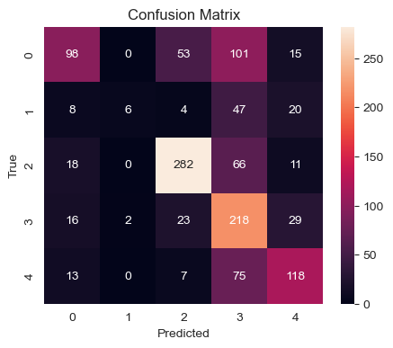
    


    

    


### SVM


```python
model = svm.SVC(C= 1, kernel='rbf')
model_metricx.append(evaluate(model,X,y,X_test,y_test))
```

    train report
    Accuracy: 0.7339300244100895
    Weighted-average F1 Score: 0.7345352665537003
    


    
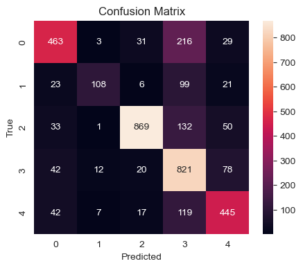
    


    

    


    
    
    
    test report
    Accuracy: 0.6439024390243903
    Weighted-average F1 Score: 0.6483679371842618
    


    

    


    

    


### HistGradientBoostingClassifier


```python
model = HistGradientBoostingClassifier()
model_metricx.append(evaluate(model,X,y,X_test,y_test))
```

    train report
    Accuracy: 0.9991863303498779
    Weighted-average F1 Score: 0.9991862287232112
    


    

    


    
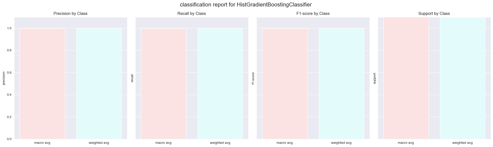
    


    
    
    
    test report
    Accuracy: 0.5967479674796748
    Weighted-average F1 Score: 0.5966634238918201
    


    
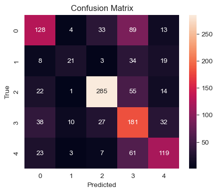
    


    

    


### VotingClassifier


```python
model = VotingClassifier(estimators=[('lr', LogisticRegression()), ('svm', svm.SVC(kernel='rbf'))])
model_metricx.append(evaluate(model,X,y,X_test,y_test))
```

    train report
    Accuracy: 0.6981285598047193
    Weighted-average F1 Score: 0.6983389969358049
    


    
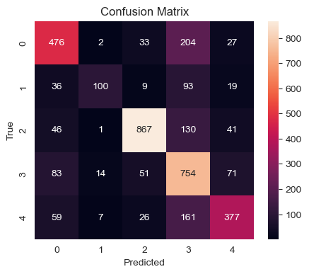
    


    

    


    
    
    
    test report
    Accuracy: 0.6333333333333333
    Weighted-average F1 Score: 0.6360165741968056
    


    
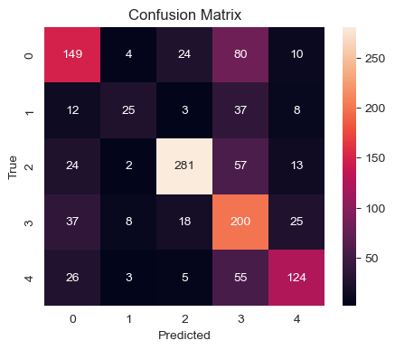
    


    
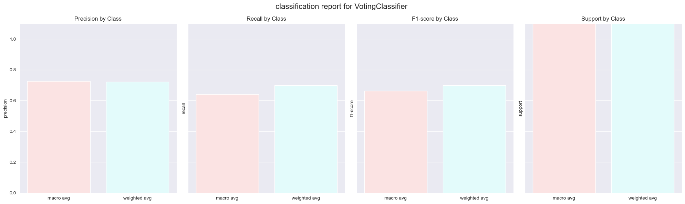
    


### LogisticRefression


```python
log_model = LogisticRegression(random_state=42, solver='saga')
model_metricx.append(evaluate(log_model,X,y,X_test,y_test))
```

    train report
    Accuracy: 0.6357472199620288
    Weighted-average F1 Score: 0.62545141840538
    


    
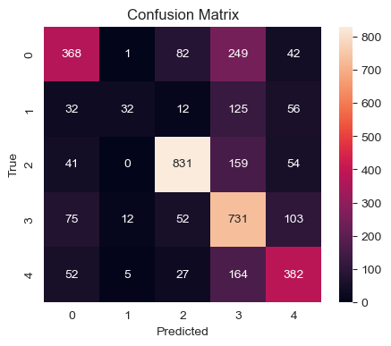
    


    
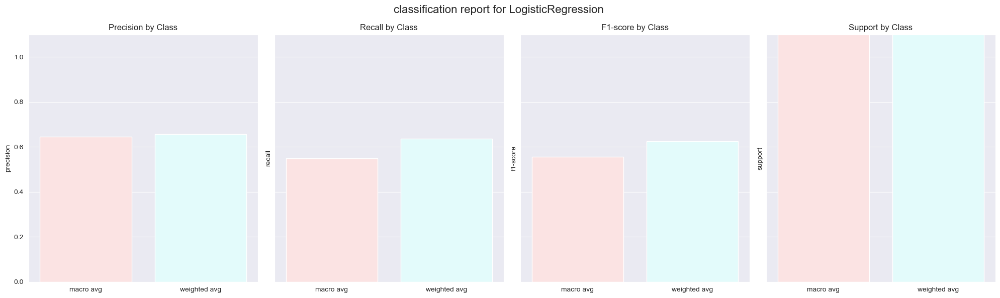
    


    
    
    
    test report
    Accuracy: 0.6138211382113821
    Weighted-average F1 Score: 0.6043419707700998
    


    
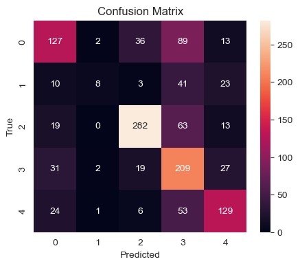
    


    

    


### XGBoost


```python
model = XGBClassifier(random_state=42,learning_rate= 0.3, max_depth= 5)
model_metricx.append(evaluate(model,X,y,X_test,y_test))
```

    train report
    Accuracy: 0.9991863303498779
    Weighted-average F1 Score: 0.999186280824265
    


    
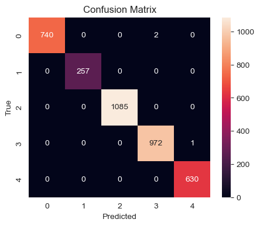
    


    
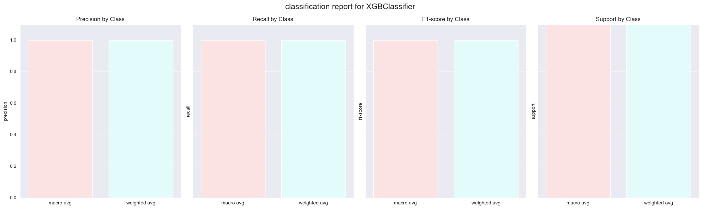
    


    
    
    
    test report
    Accuracy: 0.591869918699187
    Weighted-average F1 Score: 0.5927583275054787
    


    
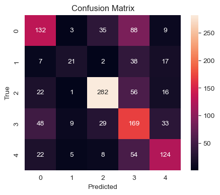
    


    

    


### KNN


```python
model = KNeighborsClassifier( n_neighbors= 7, weights =  'distance')
model_metricx.append(evaluate(model,X,y,X_test,y_test))
```

    train report
    Accuracy: 0.9991863303498779
    Weighted-average F1 Score: 0.9991862287232112
    


    

    


    

    


    
    
    
    test report
    Accuracy: 0.5926829268292683
    Weighted-average F1 Score: 0.5952145468084115
    


    
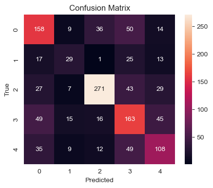
    


    
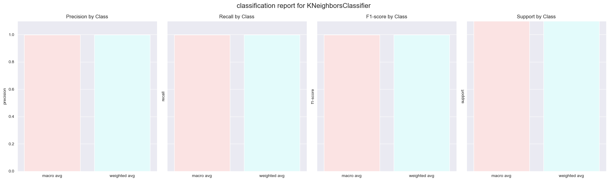
    


```python
# Convert the list of dictionaries to a DataFrame
df_model = pd.DataFrame(model_metricx)

# Melt the DataFrame to long-form for better visualization
melted_df = df_model.melt(id_vars=["model"], var_name="metric", value_name="value")

# Plotting
plt.figure(figsize=(10, 6))
sns.lineplot(x="model", y="value", hue="metric", data=melted_df)
plt.title('Model Performance Metrics')
plt.xlabel('Models')
plt.ylabel('Performance Metric Value')
plt.xticks(rotation=45)
plt.legend(title='Metric', loc='upper right')
plt.show()
```


    

    


### Model Selection and Hyperparameter Tuning

The initial phase focuses on identifying the best hyperparameters for each model through grid search cross-validation. This systematic approach ensures that each model is optimized for the given dataset, potentially leading to improved performance. Models considered include Decision Trees, Random Forests, Support Vector Machines (SVM), K-Nearest Neighbors (KNN), Extra Trees, Histogram-based Gradient Boosting, AdaBoost, Voting Classifier, Gradient Boosting, and XGBoost classifiers.


### Cross-Validation and Model Evaluation

Stratified k-fold cross-validation is employed to assess the models' performance. This method ensures that each fold of the dataset maintains the original class distribution, providing a fair evaluation of the models. The mean accuracy and standard deviation across folds serve as indicators of the models' reliability and stability.

```
best params for DecisionTreeClassifier model is: {'criterion': 'gini', 'max_depth': 5, 'min_samples_split': 2}
DecisionTreeClassifier Accuracy: 0.44 (+/- 0.05)
best params for RandomForestClassifier model is: {'max_depth': None, 'min_samples_split': 4, 'n_estimators': 200}
RandomForestClassifier Accuracy: 0.57 (+/- 0.02)
best params for SVC model is: {'C': 1, 'kernel': 'rbf'}
SVC Accuracy: 0.62 (+/- 0.02)
best params for KNeighborsClassifier model is: {'n_neighbors': 7, 'weights': 'distance'}
KNeighborsClassifier Accuracy: 0.54 (+/- 0.01)
best params for ExtraTreesClassifier model is: {'max_depth': None, 'min_samples_split': 5, 'n_estimators': 200}
ExtraTreesClassifier Accuracy: 0.57 (+/- 0.01)
best params for HistGradientBoostingClassifier model is: {}
HistGradientBoostingClassifier Accuracy: 0.60 (+/- 0.01)
best params for VotingClassifier model is: {}
VotingClassifier Accuracy: 0.61 (+/- 0.02)
best params for XGBClassifier model is: {'learning_rate': 0.3, 'max_depth': 5}
XGBClassifier Accuracy: 0.58 (+/- 0.01)
```

### Model Testing on Test Data

After selecting the best models based on cross-validation, the models are evaluated on unseen test data. Performance metrics such as accuracy, precision, recall, F1 score, and confusion matrices are computed to provide a comprehensive assessment of each model's effectiveness. These metrics offer insights into the models' ability to accurately classify instances, their precision in identifying positive instances, and their recall in capturing all relevant instances.

### Individual Model Evaluations

The report concludes with detailed evaluations of selected models, including Random Forest, SVM, HistGradientBoostingClassifier, VotingClassifier, Logistic Regression, and XGBoost. Each model is instantiated with its best-found hyperparameters and evaluated using the training and test datasets. The evaluations include accuracy, F1 score, and visualization of confusion matrices and class-specific performance metrics, providing a clear comparison of the models' capabilities.

# train model for TF-IDF data


```python
scaler = StandardScaler()
X_scaled = scaler.fit_transform(train_x)
pca = PCA(n_components=2000)
train_x = pca.fit_transform(X_scaled)

X_scaled2 = scaler.transform(test_x)
test_x = pca.transform(X_scaled2)
```


```python
model = LogisticRegression(random_state=42, solver='saga')
evaluate(model,train_x,train_y,test_x,test_y)
```

    F:\Anaconda\lib\site-packages\sklearn\linear_model\_sag.py:349: ConvergenceWarning: The max_iter was reached which means the coef_ did not converge
      warnings.warn(
    

    train report
    Accuracy: 0.9907933929054968
    Weighted-average F1 Score: 0.9907833742735682
    


    

    


    

    


    
    
    
    test report
    Accuracy: 0.5523964256701869
    Weighted-average F1 Score: 0.5528324573704188
    


    
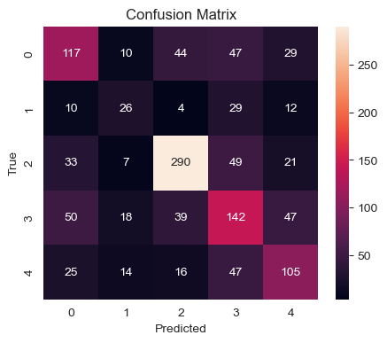
    


    
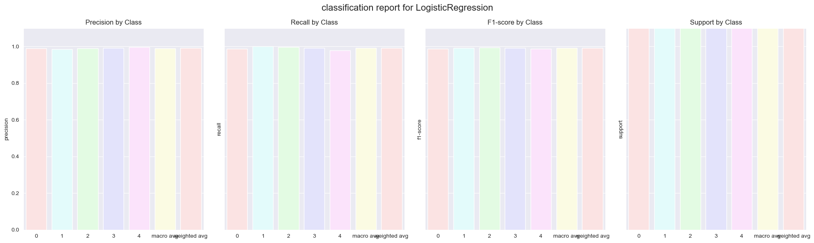
    


    {'model': 'LogisticRegression',
     'f1 train': 0.9907833742735682,
     'accuracy train': 0.9907833742735682,
     'f1 test': 0.5528324573704188,
     'accuracy test': 0.5528324573704188}


```python
model = svm.SVC(C= 1, kernel='rbf')
evaluate(model,train_x,train_y,test_x,test_y)
```

    train report
    Accuracy: 0.9038721906309234
    Weighted-average F1 Score: 0.9042533361854016
    


    
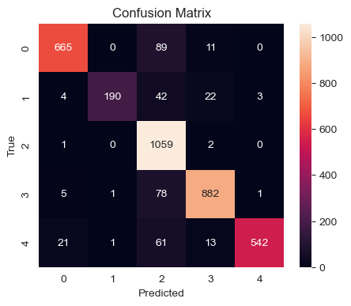
    


    
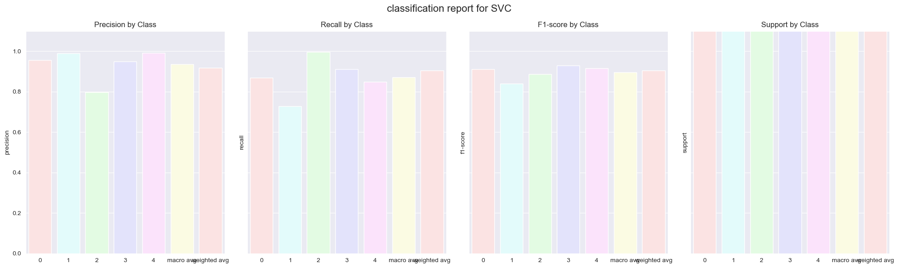
    


    
    
    
    test report
    Accuracy: 0.4248578391551584
    Weighted-average F1 Score: 0.3546948080171316
    


    
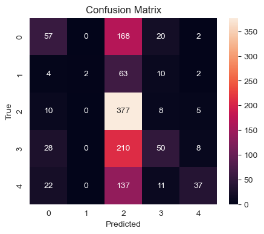
    


    

    


    {'model': 'SVC',
     'f1 train': 0.9042533361854016,
     'accuracy train': 0.9042533361854016,
     'f1 test': 0.3546948080171316,
     'accuracy test': 0.3546948080171316}


And this part do the same thing in the previous part but using the tf-ifd data set

# Prediction of test csv


```python
df_test = pd.read_csv('3rdHW_test.csv')
df_test.columns = ['text']
df_test.head()
```


<div>
<style scoped>
    .dataframe tbody tr th:only-of-type {
        vertical-align: middle;
    }

    .dataframe tbody tr th {
        vertical-align: top;
    }

    .dataframe thead th {
        text-align: right;
    }
</style>
<table border="1" class="dataframe">
  <thead>
    <tr style="text-align: right;">
      <th></th>
      <th>text</th>
    </tr>
  </thead>
  <tbody>
    <tr>
      <th>0</th>
      <td>بسیار نرم و لطیف بوده و کیفیت بالایی داره.</td>
    </tr>
    <tr>
      <th>1</th>
      <td>اصلا رنگش با چیزی که تو عکس بود خیلی فرق داشت</td>
    </tr>
    <tr>
      <th>2</th>
      <td>خیلی زیبا و ب اندازه و با دقت طراحی شده</td>
    </tr>
    <tr>
      <th>3</th>
      <td>سبزی پلو با ماهی مال عید نوروزه، امشب سوشی میخ...</td>
    </tr>
    <tr>
      <th>4</th>
      <td>لج بازیو بذار کنار یه فرصت دیگه بهت میدم</td>
    </tr>
  </tbody>
</table>
</div>


```python
df_test['text'] = df_test['text'].apply(normalizer.decrease_repeated_chars)
df_test['text'] = df_test['text'].apply(normalizer.persian_number)
df_test['text'] = df_test['text'].apply(normalizer.remove_diacritics)
df_test['text'] = df_test['text'].apply(normalizer.correct_spacing)
df_test['text'] = df_test['text'].apply(normalizer.normalize)
df_test['text'] = df_test['text'].apply(remove_stopwords)
df_test['text'] = df_test['text'].apply(remove_chars)
df_test['text'] = df_test['text'].apply(lemmatizer.lemmatize)
df_test['text'] = df_test['text'].apply(tokenizer.tokenize)
df_test['text'] = df_test['text'].apply(normalizer.token_spacing)
df_test['text_vector'] = df_test['text'].apply(vectorize_sentence)
large_array = df_test['text_vector'][0].reshape((1, 300))
temp = df_test['text_vector'][1].reshape((1, 300))
large_array = np.append(large_array, temp, axis=0)
index = 2
for row in df_test['text_vector'][2:]:
    if row is not None:
        temp = row.reshape((1, 300))
        large_array = np.append(large_array, temp, axis=0)
    index += 1
df_test2 = pd.DataFrame(large_array)
df_test2.head()
```


<div>
<style scoped>
    .dataframe tbody tr th:only-of-type {
        vertical-align: middle;
    }

    .dataframe tbody tr th {
        vertical-align: top;
    }

    .dataframe thead th {
        text-align: right;
    }
</style>
<table border="1" class="dataframe">
  <thead>
    <tr style="text-align: right;">
      <th></th>
      <th>0</th>
      <th>1</th>
      <th>2</th>
      <th>3</th>
      <th>4</th>
      <th>5</th>
      <th>6</th>
      <th>7</th>
      <th>8</th>
      <th>9</th>
      <th>...</th>
      <th>290</th>
      <th>291</th>
      <th>292</th>
      <th>293</th>
      <th>294</th>
      <th>295</th>
      <th>296</th>
      <th>297</th>
      <th>298</th>
      <th>299</th>
    </tr>
  </thead>
  <tbody>
    <tr>
      <th>0</th>
      <td>0.041038</td>
      <td>-0.062525</td>
      <td>-0.011608</td>
      <td>-0.041713</td>
      <td>0.053341</td>
      <td>-0.029435</td>
      <td>0.020472</td>
      <td>-0.027081</td>
      <td>-0.061558</td>
      <td>0.070726</td>
      <td>...</td>
      <td>0.036436</td>
      <td>0.009038</td>
      <td>-0.016462</td>
      <td>-0.034356</td>
      <td>-0.039070</td>
      <td>-0.065686</td>
      <td>-0.047734</td>
      <td>-0.000752</td>
      <td>0.017537</td>
      <td>0.038343</td>
    </tr>
    <tr>
      <th>1</th>
      <td>0.052263</td>
      <td>-0.003310</td>
      <td>-0.050873</td>
      <td>-0.032998</td>
      <td>0.056038</td>
      <td>-0.004841</td>
      <td>-0.002045</td>
      <td>0.003168</td>
      <td>-0.027713</td>
      <td>0.044717</td>
      <td>...</td>
      <td>0.009392</td>
      <td>-0.016067</td>
      <td>0.014416</td>
      <td>0.003931</td>
      <td>-0.057742</td>
      <td>-0.055079</td>
      <td>-0.027272</td>
      <td>-0.014642</td>
      <td>0.028058</td>
      <td>0.020587</td>
    </tr>
    <tr>
      <th>2</th>
      <td>0.002832</td>
      <td>-0.008856</td>
      <td>-0.018215</td>
      <td>-0.044157</td>
      <td>0.032683</td>
      <td>0.024009</td>
      <td>-0.015656</td>
      <td>-0.015632</td>
      <td>-0.072768</td>
      <td>0.036306</td>
      <td>...</td>
      <td>0.042105</td>
      <td>-0.018045</td>
      <td>-0.032276</td>
      <td>-0.008935</td>
      <td>-0.033012</td>
      <td>-0.037415</td>
      <td>0.000088</td>
      <td>-0.033479</td>
      <td>-0.007761</td>
      <td>0.016171</td>
    </tr>
    <tr>
      <th>3</th>
      <td>0.035614</td>
      <td>-0.015606</td>
      <td>-0.018494</td>
      <td>-0.041054</td>
      <td>-0.011867</td>
      <td>-0.006266</td>
      <td>-0.007912</td>
      <td>-0.007633</td>
      <td>-0.032851</td>
      <td>0.046541</td>
      <td>...</td>
      <td>-0.010006</td>
      <td>0.010708</td>
      <td>-0.035008</td>
      <td>-0.012093</td>
      <td>-0.054277</td>
      <td>-0.037666</td>
      <td>0.007189</td>
      <td>-0.015148</td>
      <td>-0.032108</td>
      <td>0.009488</td>
    </tr>
    <tr>
      <th>4</th>
      <td>-0.031692</td>
      <td>-0.005498</td>
      <td>-0.022588</td>
      <td>-0.014044</td>
      <td>-0.013410</td>
      <td>0.014084</td>
      <td>-0.003615</td>
      <td>0.017723</td>
      <td>-0.002210</td>
      <td>0.067652</td>
      <td>...</td>
      <td>-0.019922</td>
      <td>0.023115</td>
      <td>-0.006946</td>
      <td>0.021995</td>
      <td>-0.021737</td>
      <td>-0.022677</td>
      <td>-0.039028</td>
      <td>-0.015941</td>
      <td>-0.049122</td>
      <td>-0.009136</td>
    </tr>
  </tbody>
</table>
<p>5 rows × 300 columns</p>
</div>


```python
svm_model = svm.SVC(C= 1, kernel='rbf')
svm_model.fit(X,y)
predictions = svm_model.predict(df_test2)
predictions = np.append(predictions,2)
```


```python
def manual_inverse_transform(encoded_labels, le):
    encoded_labels = list(encoded_labels)
    original_labels=[le.classes_[int(label)] for label in encoded_labels]
    return original_labels
```


```python
original_predictions = manual_inverse_transform(predictions,le)
```


```python
res = pd.read_csv('3rdHW_test.csv')
res['preds'] = original_predictions
res.columns = ['X','Y']
res
```


<div>
<style scoped>
    .dataframe tbody tr th:only-of-type {
        vertical-align: middle;
    }

    .dataframe tbody tr th {
        vertical-align: top;
    }

    .dataframe thead th {
        text-align: right;
    }
</style>
<table border="1" class="dataframe">
  <thead>
    <tr style="text-align: right;">
      <th></th>
      <th>X</th>
      <th>Y</th>
    </tr>
  </thead>
  <tbody>
    <tr>
      <th>0</th>
      <td>بسیار نرم و لطیف بوده و کیفیت بالایی داره.</td>
      <td>HAPPY</td>
    </tr>
    <tr>
      <th>1</th>
      <td>اصلا رنگش با چیزی که تو عکس بود خیلی فرق داشت</td>
      <td>ANGRY</td>
    </tr>
    <tr>
      <th>2</th>
      <td>خیلی زیبا و ب اندازه و با دقت طراحی شده</td>
      <td>HAPPY</td>
    </tr>
    <tr>
      <th>3</th>
      <td>سبزی پلو با ماهی مال عید نوروزه، امشب سوشی میخ...</td>
      <td>OTHER</td>
    </tr>
    <tr>
      <th>4</th>
      <td>لج بازیو بذار کنار یه فرصت دیگه بهت میدم</td>
      <td>OTHER</td>
    </tr>
    <tr>
      <th>...</th>
      <td>...</td>
      <td>...</td>
    </tr>
    <tr>
      <th>542</th>
      <td>سرخط خبرهای ۶ عصر، پنجشنبه ۲۹ جدی ۱۴۰۱</td>
      <td>HAPPY</td>
    </tr>
    <tr>
      <th>543</th>
      <td>بوی عالی  ماندگاری خوب خیلی خوشم امدش مرسی دیجی</td>
      <td>OTHER</td>
    </tr>
    <tr>
      <th>544</th>
      <td>گاز که نداریم اینترنت هم روش? #وطن</td>
      <td>ANGRY</td>
    </tr>
    <tr>
      <th>545</th>
      <td>من چندتاشو برا مغازه گرفتم باطریاشون کلا خرابن!</td>
      <td>ANGRY</td>
    </tr>
    <tr>
      <th>546</th>
      <td>خیلی بی کیفیت \nحتی بچه ها هم باهاش بازی نمیکنن</td>
      <td>HAPPY</td>
    </tr>
  </tbody>
</table>
<p>547 rows × 2 columns</p>
</div>


```python
res.to_csv('result.csv', index=False)
```


```python

```
